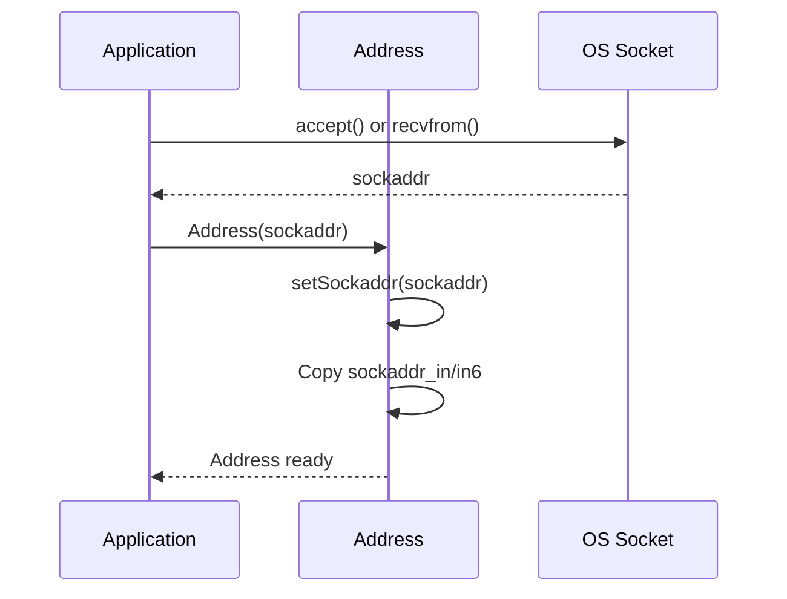
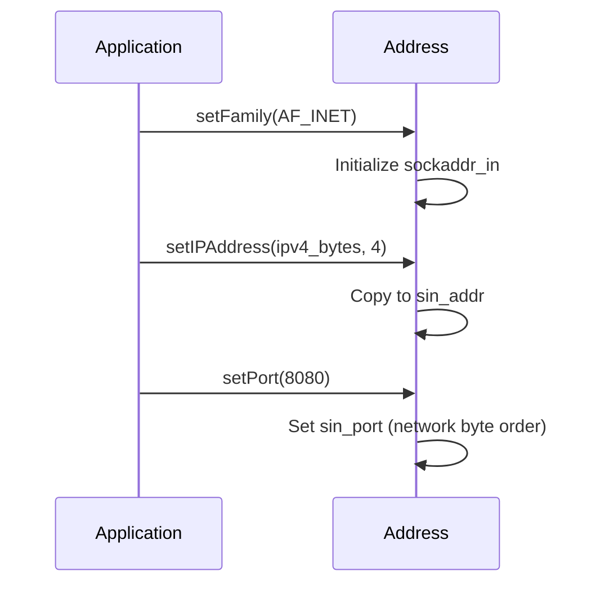
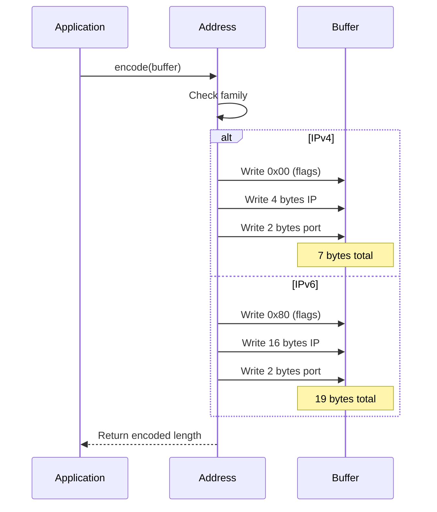
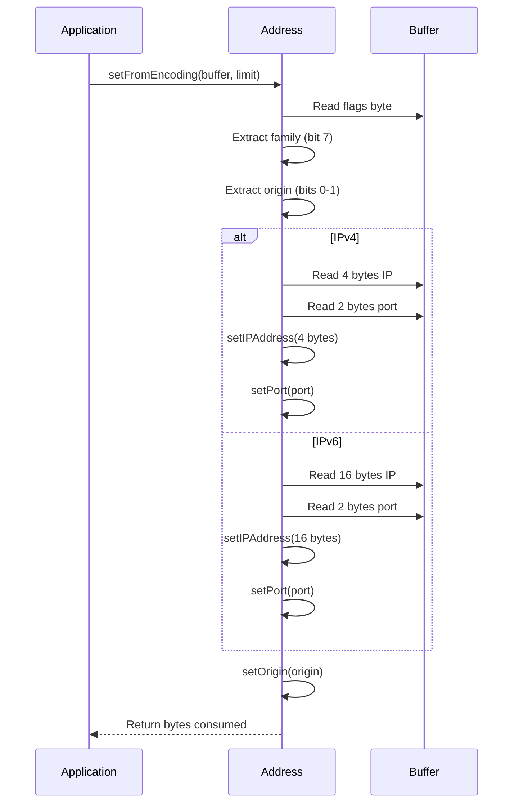
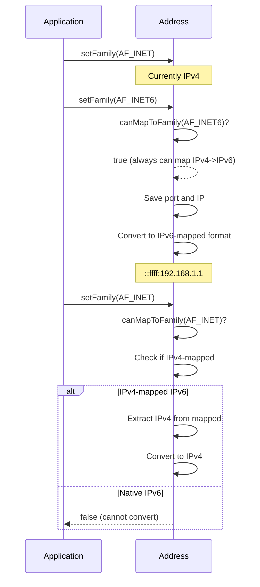
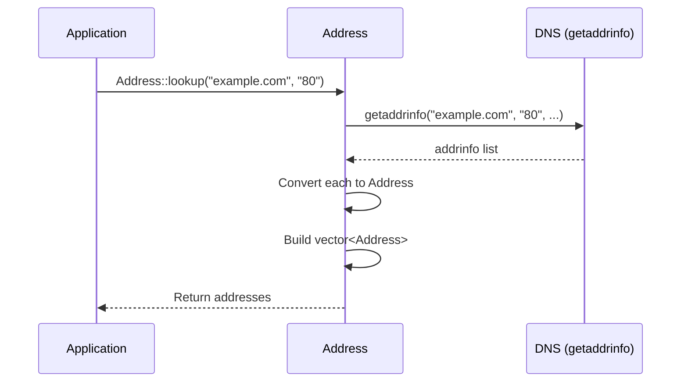
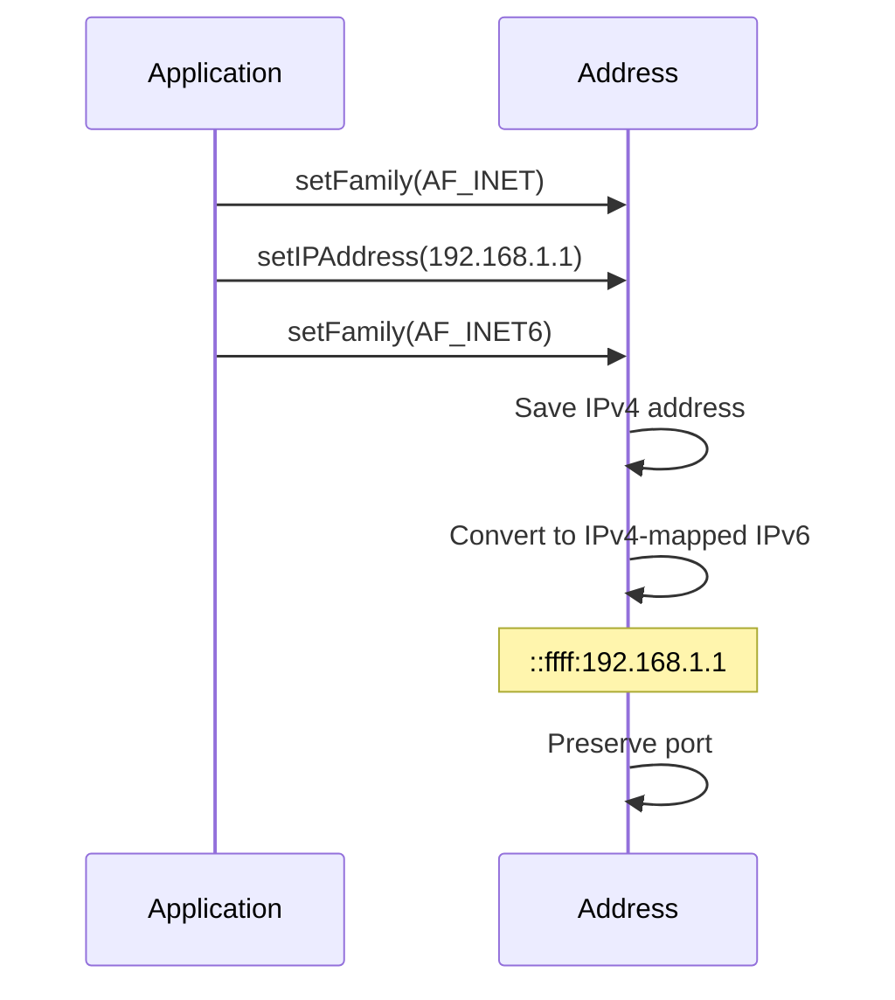
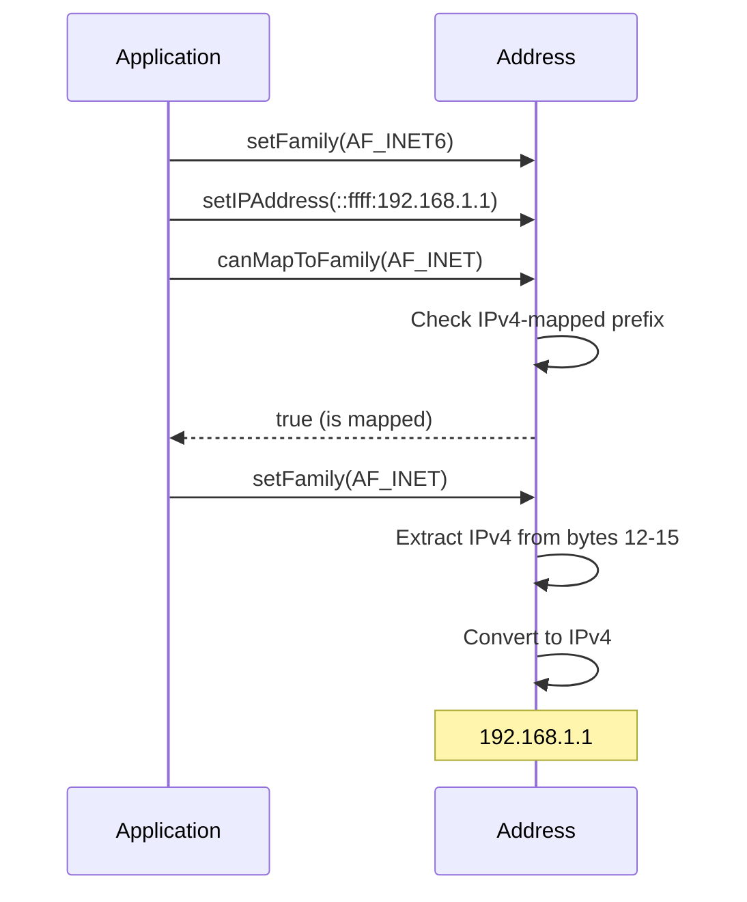

# Address: Comprehensive Documentation

**Date:** 2024

## Overview

`Address` provides a unified representation for IPv4 and IPv6 network addresses with port numbers, supporting conversion between formats, encoding/decoding, and DNS lookup.

---

## Table of Contents

1. [Architecture](#architecture)
2. [Address Formats](#address-formats)
3. [Interaction Diagrams](#interaction-diagrams)
4. [API Reference](#api-reference)
5. [Encoding/Decoding](#encodingdecoding)
6. [Family Conversion](#family-conversion)
7. [Usage Patterns](#usage-patterns)
8. [Best Practices](#best-practices)

---

## Architecture

### Address Structure

```
┌─────────────────────────────────────┐
│           Address                   │
│  ┌───────────────────────────────┐ │
│  │  in_sockaddr union             │ │
│  │  - sockaddr (generic)          │ │
│  │  - sockaddr_in (IPv4)          │ │
│  │  - sockaddr_in6 (IPv6)          │ │
│  └───────────────────────────────┘ │
│  ┌───────────────────────────────┐ │
│  │  Origin                        │ │
│  │  - UNKNOWN, REPORTED, etc.     │ │
│  └───────────────────────────────┘ │
└─────────────────────────────────────┘
```

### Supported Formats

```
┌─────────────────────────────────────┐
│  Address Formats                    │
│  ┌───────────────────────────────┐ │
│  │  sockaddr (native)            │ │
│  │  - Direct OS integration      │ │
│  └───────────────────────────────┘ │
│  ┌───────────────────────────────┐ │
│  │  Binary encoding              │ │
│  │  - Compact wire format        │ │
│  └───────────────────────────────┘ │
│  ┌───────────────────────────────┐ │
│  │  Presentation string          │ │
│  │  - Human-readable format      │ │
│  └───────────────────────────────┘ │
│  ┌───────────────────────────────┐ │
│  │  Raw bytes                    │ │
│  │  - IP address only            │ │
│  └───────────────────────────────┘ │
└─────────────────────────────────────┘
```

---

## Address Formats

### IPv4 Address

```
┌─────────────────────────────────────┐
│  IPv4 Address (7 bytes encoded)     │
│  ┌───┬──────────────┬─────┐      │
│  │0x0│ 4 bytes IP   │ 2 port│      │
│  └───┴──────────────┴─────┘      │
│  Flags: 0x00 (IPv4)                │
└─────────────────────────────────────┘
```

### IPv6 Address

```
┌─────────────────────────────────────┐
│  IPv6 Address (19 bytes encoded)    │
│  ┌───┬──────────────────┬─────┐  │
│  │0x8│ 16 bytes IP      │ 2 port│  │
│  └───┴──────────────────┴─────┘  │
│  Flags: 0x80 (IPv6)                │
└─────────────────────────────────────┘
```

### Encoding Format

```
Byte 0: Flags
  Bit 7: 1 = IPv6, 0 = IPv4
  Bits 0-1: Origin (UNKNOWN=0, REPORTED=1, OBSERVED=2, RELAY=3)
Bytes 1-4/16: IP address (4 for IPv4, 16 for IPv6)
Bytes 5-6/17-18: Port (big-endian)
```

---

## Interaction Diagrams

### Creating Address from sockaddr



### Setting IP and Port



### Encoding Address



### Decoding Address



### Family Conversion



### DNS Lookup



---

## API Reference

### Construction

```cpp
Address();
Address(const Address &other);
Address(const struct sockaddr *addr, Origin origin = ORIGIN_UNKNOWN);
```

**Behavior:**
- Default: Creates empty address
- Copy: Copies address and origin
- From sockaddr: Initializes from OS socket address

### Family Management

```cpp
bool setFamily(int family);
bool canMapToFamily(int family) const;
int getFamily() const;
```

**Families:**
- `AF_INET`: IPv4
- `AF_INET6`: IPv6

**Behavior:**
- `setFamily()`: Changes family, preserves IP/port if possible
- `canMapToFamily()`: Checks if conversion is possible
- `getFamily()`: Returns current family

**Mapping Rules:**
- IPv4 → IPv6: Always possible (IPv4-mapped IPv6)
- IPv6 → IPv4: Only if IPv4-mapped IPv6

### IP Address

```cpp
size_t getIPAddressLength() const;
const uint8_t *getIPAddressPtr() const;
size_t getIPAddress(uint8_t *dst) const;
std::vector<uint8_t> getIPAddress() const;

bool setIPAddress(const uint8_t *src, size_t len);
```

**Lengths:**
- IPv4: 4 bytes
- IPv6: 16 bytes

**Behavior:**
- `getIPAddressLength()`: Returns 4 or 16
- `getIPAddressPtr()`: Returns pointer to internal storage
- `getIPAddress(dst)`: Copies to buffer, returns length
- `setIPAddress()`: Sets IP, auto-sets family based on length

### Port

```cpp
void setPort(unsigned port);
unsigned getPort() const;
```

**Behavior:**
- `setPort()`: Sets port (0-65535), converts to network byte order
- `getPort()`: Returns port in host byte order

### Origin

```cpp
void setOrigin(Origin origin);
Origin getOrigin() const;
```

**Origins:**
- `ORIGIN_UNKNOWN`: Unknown source
- `ORIGIN_REPORTED`: Reported by peer
- `ORIGIN_OBSERVED`: Observed from network
- `ORIGIN_RELAY`: From relay server

### sockaddr Integration

```cpp
bool setSockaddr(const struct sockaddr *addr);
const struct sockaddr *getSockaddr() const;
size_t getSockaddrLen() const;
static size_t getSockaddrLen(const struct sockaddr *addr);
```

**Behavior:**
- `setSockaddr()`: Initializes from OS sockaddr
- `getSockaddr()`: Returns pointer to internal sockaddr
- `getSockaddrLen()`: Returns size of sockaddr structure

### Encoding/Decoding

```cpp
size_t setFromEncoding(const uint8_t *src, const uint8_t *limit);
size_t getEncodedLength() const;
size_t encode(uint8_t *dst) const;
std::vector<uint8_t> encode() const;
```

**Encoding Format:**
- Byte 0: Flags (family + origin)
- Bytes 1-4/16: IP address
- Bytes 5-6/17-18: Port (big-endian)

**Lengths:**
- IPv4: 7 bytes
- IPv6: 19 bytes

### Presentation Format

```cpp
std::string toPresentation(bool withPort = true) const;
void toPresentation(char *dst, bool withPort = true) const;
bool setFromPresentation(const char *src, bool withPort = true);
```

**Formats:**
- IPv4: `192.168.1.1:8080` or `192.168.1.1`
- IPv6: `[2001:db8::1]:8080` or `2001:db8::1`

**Behavior:**
- `toPresentation()`: Converts to string
- `setFromPresentation()`: Parses from string

### DNS Lookup

```cpp
static std::vector<Address> lookup(
    const char *hostname,
    const char *servname,
    int *err = nullptr,
    int ai_flags = 0,
    int ai_family = PF_UNSPEC,
    int ai_protocol = IPPROTO_UDP
);
```

**Parameters:**
- `hostname`: Hostname or IP address string
- `servname`: Service name or port number
- `err`: Optional error code output
- `ai_flags`: getaddrinfo flags
- `ai_family`: Address family preference
- `ai_protocol`: Protocol (UDP/TCP)

**Returns:** Vector of addresses (may be empty on error)

**Platform:** POSIX only (not Windows)

### Comparison

```cpp
bool operator==(const Address &rhs) const;
bool operator<(const Address &rhs) const;
Address& operator=(const Address &rhs);
```

**Behavior:**
- `operator==`: Compares IP and port
- `operator<`: Lexicographic comparison (for sorting)
- `operator=`: Assignment with copy

---

## Encoding/Decoding

### Encoding Format Details

**IPv4 Encoding (7 bytes):**
```
Offset  Size  Field
0       1     Flags (0x00-0x03 for origin)
1       4     IPv4 address
5       2     Port (big-endian)
```

**IPv6 Encoding (19 bytes):**
```
Offset  Size  Field
0       1     Flags (0x80-0x83 for origin + IPv6 bit)
1       16    IPv6 address
17      2     Port (big-endian)
```

### Encoding Example

```cpp
Address addr;
addr.setFamily(AF_INET);
uint8_t ip[4] = {192, 168, 1, 1};
addr.setIPAddress(ip, 4);
addr.setPort(8080);
addr.setOrigin(Address::ORIGIN_REPORTED);

uint8_t buffer[7];
size_t len = addr.encode(buffer);
// buffer: [0x01, 0xC0, 0xA8, 0x01, 0x01, 0x1F, 0x90]
//          flags  IP address (4 bytes)    port (2 bytes)
```

### Decoding Example

```cpp
uint8_t buffer[7] = {0x01, 0xC0, 0xA8, 0x01, 0x01, 0x1F, 0x90};
Address addr;
size_t consumed = addr.setFromEncoding(buffer, buffer + 7);
// addr now contains: 192.168.1.1:8080, origin=REPORTED
```

---

## Family Conversion

### IPv4 to IPv6



**Mapping Format:**
- IPv4 `192.168.1.1` → IPv6 `::ffff:192.168.1.1`
- First 12 bytes: `00 00 00 00 00 00 00 00 00 00 FF FF`
- Last 4 bytes: IPv4 address

### IPv6 to IPv4



**Unmapping:**
- Only works for IPv4-mapped IPv6 addresses
- Extracts last 4 bytes as IPv4 address

---

## Usage Patterns

### Pattern 1: Create from sockaddr

```cpp
struct sockaddr_in addr;
// ... fill addr from accept() or recvfrom() ...

Address address(&addr.s);
// Use address
```

### Pattern 2: Create from IP and Port

```cpp
Address addr;
addr.setFamily(AF_INET);
uint8_t ip[4] = {192, 168, 1, 1};
addr.setIPAddress(ip, 4);
addr.setPort(8080);
```

### Pattern 3: Create from String

```cpp
Address addr;
addr.setFromPresentation("192.168.1.1:8080");
// Or IPv6
addr.setFromPresentation("[2001:db8::1]:8080");
```

### Pattern 4: DNS Lookup

```cpp
int err = 0;
auto addresses = Address::lookup("example.com", "80", &err);
if(err == 0 && !addresses.empty()) {
    // Use first address
    Address addr = addresses[0];
}
```

### Pattern 5: Encode for Network

```cpp
Address addr;
// ... set address ...

uint8_t buffer[Address::MAX_ENCODED_SIZE];
size_t len = addr.encode(buffer);
// Send buffer over network
```

### Pattern 6: Decode from Network

```cpp
uint8_t buffer[Address::MAX_ENCODED_SIZE];
// Receive from network ...

Address addr;
size_t consumed = addr.setFromEncoding(buffer, buffer + received_len);
if(consumed > 0) {
    // Use address
}
```

### Pattern 7: Family Conversion

```cpp
Address addr;
addr.setFamily(AF_INET);
addr.setIPAddress(ipv4, 4);
addr.setPort(8080);

// Convert to IPv6
if(addr.canMapToFamily(AF_INET6)) {
    addr.setFamily(AF_INET6);
    // Now IPv6-mapped format
}
```

### Pattern 8: Comparison and Sorting

```cpp
std::vector<Address> addresses;
// ... populate ...

// Sort addresses
std::sort(addresses.begin(), addresses.end());

// Find address
Address target;
auto it = std::find(addresses.begin(), addresses.end(), target);
```

---

## Best Practices

### 1. Check Family Before Operations

```cpp
// ✅ CORRECT
Address addr;
if(addr.getFamily() == AF_INET) {
    uint8_t ip[4];
    addr.getIPAddress(ip);
}

// ❌ WRONG
uint8_t ip[4];
addr.getIPAddress(ip);  // May be IPv6!
```

### 2. Use Appropriate Buffer Sizes

```cpp
// ✅ CORRECT
uint8_t buffer[Address::MAX_ENCODED_SIZE];  // 19 bytes
size_t len = addr.encode(buffer);

// ❌ WRONG
uint8_t buffer[7];  // Too small for IPv6!
```

### 3. Check Encoding/Decoding Results

```cpp
// ✅ CORRECT
size_t consumed = addr.setFromEncoding(buffer, limit);
if(consumed == 0) {
    // Error - invalid encoding
}

// ❌ WRONG
addr.setFromEncoding(buffer, limit);
// Didn't check if it worked
```

### 4. Handle DNS Lookup Errors

```cpp
// ✅ CORRECT
int err = 0;
auto addresses = Address::lookup("hostname", "80", &err);
if(err != 0 || addresses.empty()) {
    // Handle error
}

// ❌ WRONG
auto addresses = Address::lookup("hostname", "80");
// Didn't check for errors
```

### 5. Use Presentation Format for Logging

```cpp
// ✅ CORRECT
Address addr;
// ... set address ...
std::string str = addr.toPresentation();
std::cout << "Address: " << str << std::endl;

// ❌ WRONG
std::cout << "Address: " << addr.getPort() << std::endl;
// Doesn't show IP
```

### 6. Preserve Origin Information

```cpp
// ✅ CORRECT
Address addr;
addr.setFromEncoding(buffer, limit);
Origin origin = addr.getOrigin();
// Use origin information

// ⚠️ OK but loses information
addr.setOrigin(Address::ORIGIN_UNKNOWN);
```

---

## Thread Safety

| Operation | Thread-Safe | Notes |
|-----------|-------------|-------|
| Construction | ✅ Yes | Creates independent object |
| Assignment | ✅ Yes | Copies data |
| Getters | ✅ Yes | Read-only operations |
| Setters | ⚠️ Partial | Not thread-safe if same object |
| Encoding/Decoding | ✅ Yes | Operates on copies |

**Recommendation:** Each thread should use its own Address objects.

---

## Common Pitfalls

### Pitfall 1: Wrong Buffer Size

```cpp
// ❌ WRONG
uint8_t buffer[7];  // Only for IPv4
addr.encode(buffer);  // Fails for IPv6!

// ✅ CORRECT
uint8_t buffer[Address::MAX_ENCODED_SIZE];
addr.encode(buffer);
```

### Pitfall 2: Not Checking Family

```cpp
// ❌ WRONG
uint8_t ip[4];
addr.getIPAddress(ip);  // Assumes IPv4

// ✅ CORRECT
if(addr.getFamily() == AF_INET) {
    uint8_t ip[4];
    addr.getIPAddress(ip);
}
```

### Pitfall 3: Ignoring Encoding Errors

```cpp
// ❌ WRONG
addr.setFromEncoding(buffer, limit);
// Didn't check if it worked

// ✅ CORRECT
size_t consumed = addr.setFromEncoding(buffer, limit);
if(consumed == 0) {
    // Handle error
}
```

### Pitfall 4: Port Byte Order

```cpp
// ❌ WRONG
addr.setPort(ntohs(8080));  // Double conversion!

// ✅ CORRECT
addr.setPort(8080);  // setPort handles conversion
unsigned port = addr.getPort();  // getPort handles conversion
```

### Pitfall 5: IPv6 to IPv4 Conversion

```cpp
// ❌ WRONG
Address addr;
addr.setFamily(AF_INET6);
addr.setIPAddress(native_ipv6, 16);
addr.setFamily(AF_INET);  // Fails - not IPv4-mapped!

// ✅ CORRECT
if(addr.canMapToFamily(AF_INET)) {
    addr.setFamily(AF_INET);
}
```

---

## Performance Considerations

### Encoding/Decoding

- **Encoding**: ~10-50 ns (memcpy operations)
- **Decoding**: ~10-50 ns (memcpy + parsing)
- **Presentation**: ~100-1000 ns (string formatting)

### DNS Lookup

- **Local cache**: ~1-10 ms
- **Network lookup**: ~10-1000 ms (depends on network)

### Memory

- **Address object**: ~32 bytes (sockaddr_in6 size)
- **Encoded IPv4**: 7 bytes
- **Encoded IPv6**: 19 bytes

---

## Summary

**Key Takeaways:**

1. ✅ Supports both IPv4 and IPv6
2. ✅ Compact binary encoding (7/19 bytes)
3. ✅ Presentation string format
4. ✅ DNS lookup support (POSIX)
5. ✅ Family conversion (IPv4 ↔ IPv6 mapped)
6. ✅ Origin tracking
7. ⚠️ Check family before operations
8. ⚠️ Use MAX_ENCODED_SIZE for buffers

**Recommended Practices:**

- Use `MAX_ENCODED_SIZE` for encoding buffers
- Check family before IP operations
- Verify encoding/decoding return values
- Handle DNS lookup errors
- Use presentation format for logging
- Preserve origin information when possible

