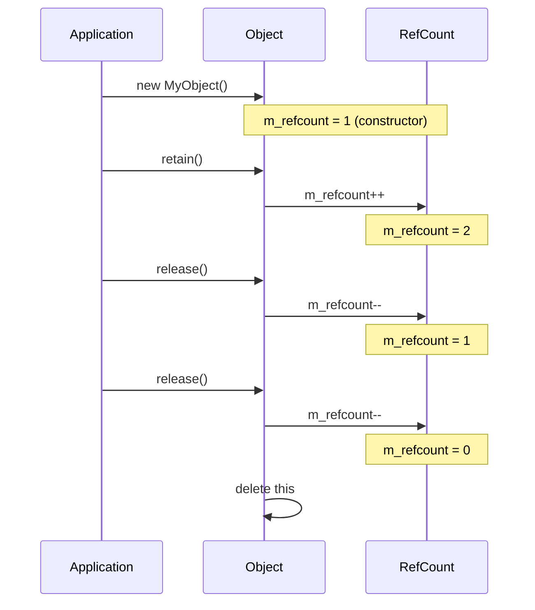
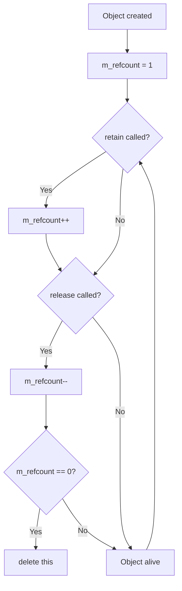
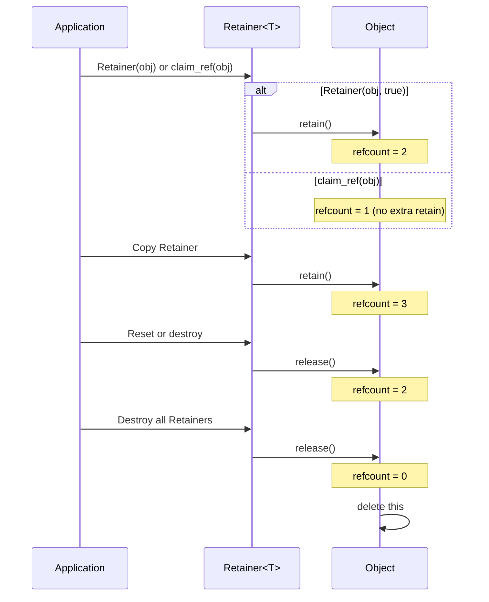
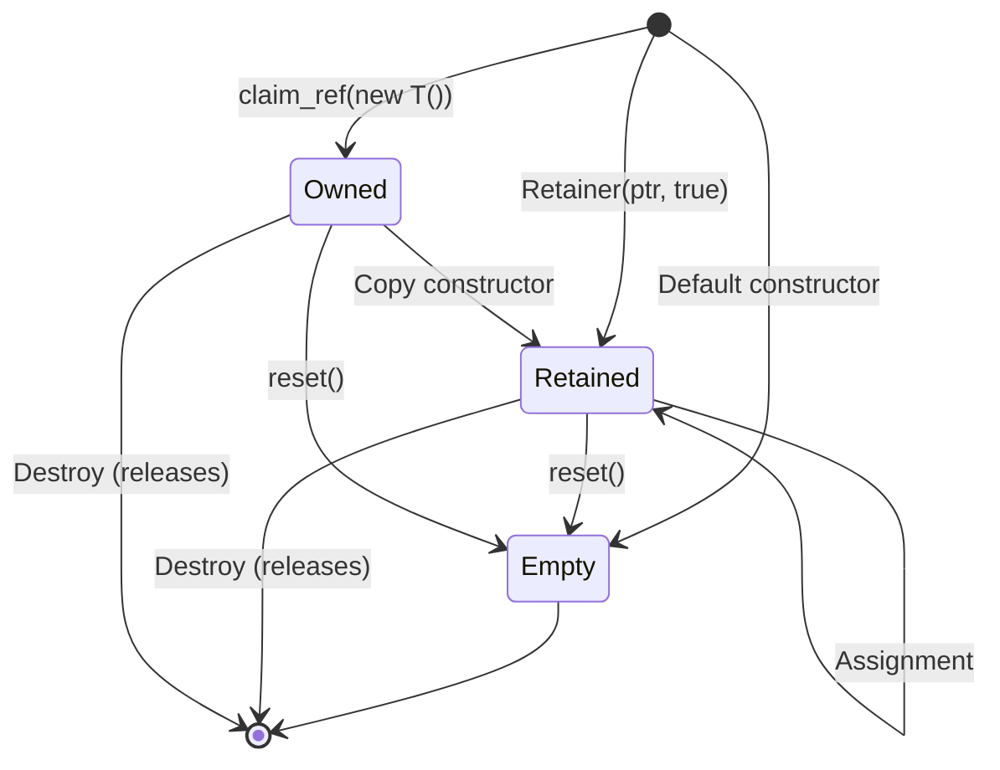
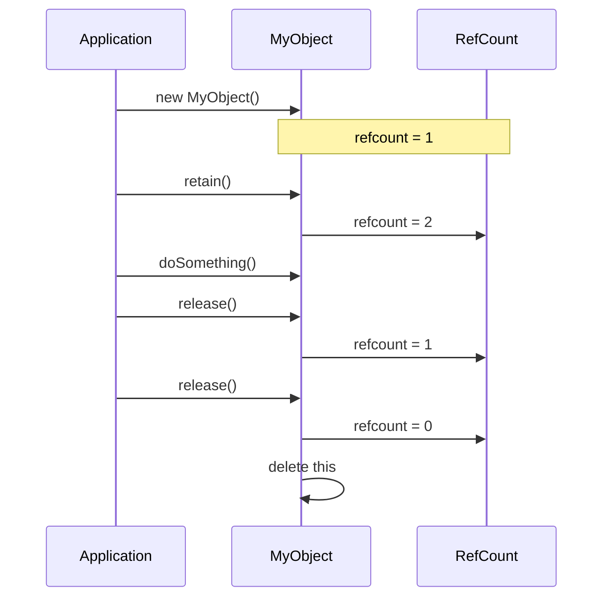
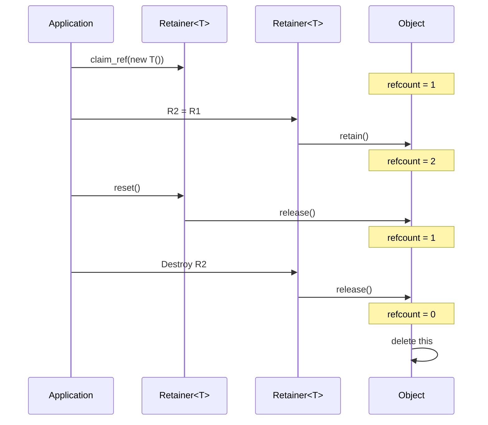
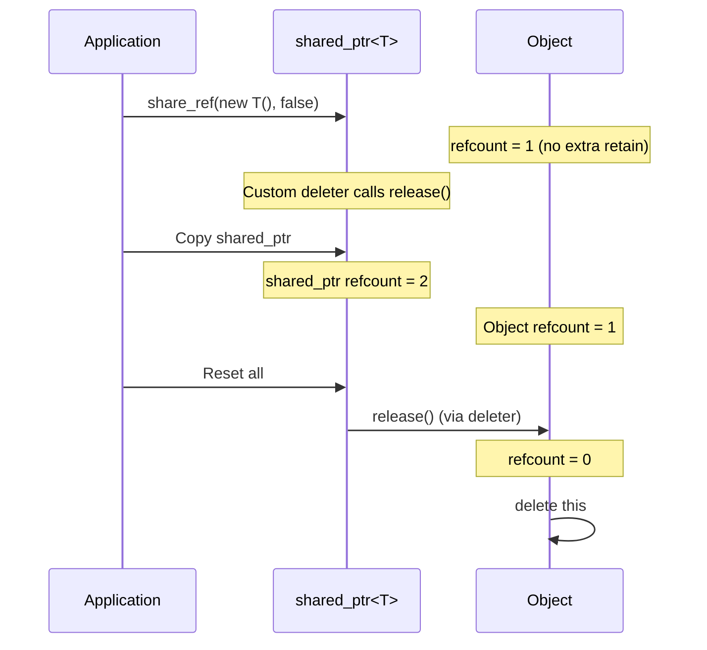
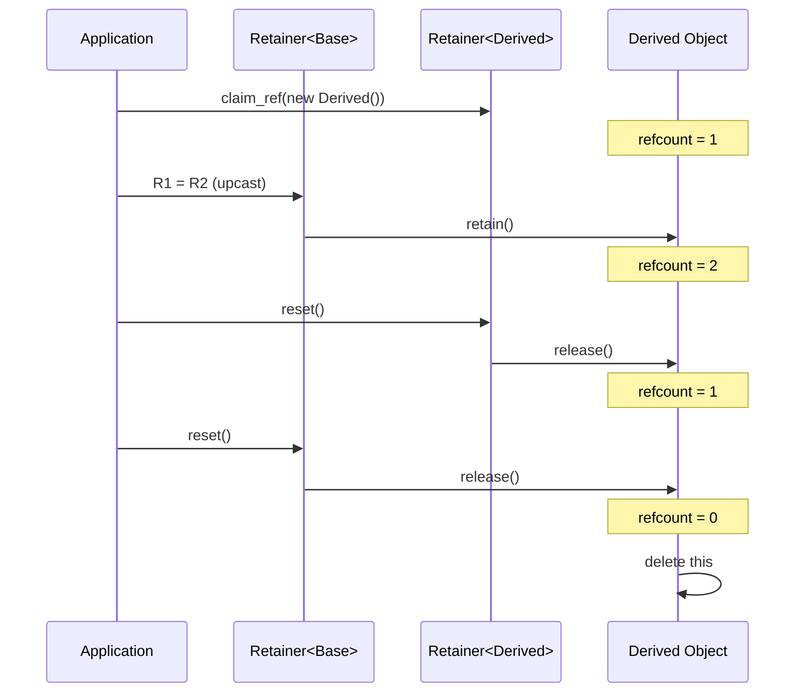

# Memory Management: Comprehensive Documentation

**Date:** 2024

## Overview

libzenomt provides intrusive reference counting through `Object` and `Retainer<T>`, offering zero-overhead smart pointers that integrate with the library's object model.

---

## Table of Contents

1. [Architecture](#architecture)
2. [Object Reference Counting](#object-reference-counting)
3. [Retainer Smart Pointer](#retainer-smart-pointer)
4. [Interaction Diagrams](#interaction-diagrams)
5. [API Reference](#api-reference)
6. [Usage Patterns](#usage-patterns)
7. [Comparison with std::shared_ptr](#comparison-with-stdshared_ptr)
8. [Best Practices](#best-practices)

---

## Architecture

### Reference Counting Model

```
┌─────────────────────────────────┐
│         Object                  │
│  - m_refcount: atomic<long>     │
│  - retain(): ++m_refcount       │
│  - release(): --m_refcount      │
│  - delete this when count = 0   │
└─────────────────────────────────┘
           ▲
           │ inherits
           │
┌─────────────────────────────────┐
│    User Classes                │
│  - Timer, RunLoop, etc.         │
└─────────────────────────────────┘
```

### Memory Management Options

```
┌─────────────────────────────────────┐
│  Memory Management                 │
│  ┌───────────────────────────────┐ │
│  │  Object + Retainer<T>          │ │
│  │  - Intrusive reference count   │ │
│  │  - Zero overhead               │ │
│  │  - Library-native              │ │
│  └───────────────────────────────┘ │
│  ┌───────────────────────────────┐ │
│  │  Object + share_ref()         │ │
│  │  - Intrusive + shared_ptr     │ │
│  │  - Bridge to standard library  │ │
│  └───────────────────────────────┘ │
│  ┌───────────────────────────────┐ │
│  │  std::shared_ptr<T>           │ │
│  │  - Standard library           │ │
│  │  - External reference count   │ │
│  └───────────────────────────────┘ │
└─────────────────────────────────────┘
```

---

## Object Reference Counting

### Lifecycle



### Reference Count Operations



---

## Retainer Smart Pointer

### Retainer Lifecycle



### Retainer Operations



---

## Interaction Diagrams

### Basic Object Usage



### Retainer Usage



### share_ref Bridge



### Inheritance and Polymorphism



---

## API Reference

### Object

#### Construction

```cpp
Object();
```

**Effects:**
- Initializes `m_refcount = 1`
- Object starts with one reference (from constructor)

#### Reference Counting

```cpp
virtual void retain();
virtual void release();

static void retain(Object *obj);
static void release(Object *obj);
```

**Behavior:**
- `retain()`: Increments reference count
- `release()`: Decrements reference count, deletes if count reaches 0
- Static versions handle null pointers safely

**Thread Safety:**
- Uses `std::atomic_long` for thread-safe reference counting
- Safe to call from multiple threads

#### Copy Prevention

```cpp
Object(const Object&) = delete;
```

**Effect:** Prevents copying, enforces pointer-based usage

### share_ref()

```cpp
template <class T>
std::shared_ptr<T> share_ref(T *obj, bool retain = true);
```

**Parameters:**
- `obj`: Pointer to Object-derived instance
- `retain`: If `true`, calls `retain()` before wrapping

**Returns:** `std::shared_ptr<T>` with custom deleter that calls `release()`

**Use cases:**
- Bridge to APIs expecting `shared_ptr`
- Integration with standard library containers

### Retainer<T>

#### Construction

```cpp
Retainer();  // Empty
Retainer(std::nullptr_t);  // Empty
Retainer(T *ptr);  // Retains ptr
Retainer(T *ptr, bool retain);  // Conditionally retains
Retainer(const Retainer &other);  // Copy (retains)
Retainer(Retainer &&other);  // Move (no retain/release)
```

**Special Constructors:**
- `Retainer(ptr, false)`: Claims ownership without extra retain
- Copy constructor: Always retains
- Move constructor: Transfers ownership, no retain/release

#### Assignment

```cpp
Retainer& operator=(const Retainer &other);
Retainer& operator=(Retainer &&other);
template <class U> Retainer& operator=(const Retainer<U> &other);
```

**Behavior:**
- Copy assignment: Releases old, retains new
- Move assignment: Releases old, transfers new
- Cross-type assignment: Supports inheritance

#### Access

```cpp
T * get() const;
T * operator->() const;
T & operator*() const;
```

**Behavior:**
- `get()`: Returns raw pointer
- `operator->()`: Dereference to member access
- `operator*()`: Dereference to reference

#### State

```cpp
void reset();
bool empty() const;
operator bool() const;
```

**Behavior:**
- `reset()`: Releases current object, becomes empty
- `empty()`: Returns `true` if no object held
- `operator bool()`: Returns `false` if empty

#### Comparison

```cpp
bool operator==(const Retainer &other) const;
bool operator!=(const Retainer &other) const;
bool operator<(const Retainer &other) const;
// ... other comparison operators
```

**Behavior:**
- Compares raw pointers, not object values
- Supports comparison with `nullptr`

### Helper Functions

```cpp
template <class T> Retainer<T> retain_ref(T *ptr);
template <class T> Retainer<T> claim_ref(T *ptr);
```

**Behavior:**
- `retain_ref(ptr)`: Creates Retainer that retains (equivalent to `Retainer(ptr, true)`)
- `claim_ref(ptr)`: Creates Retainer without extra retain (equivalent to `Retainer(ptr, false)`)

**Use cases:**
- `claim_ref(new T())`: Take ownership of newly created object
- `retain_ref(existing)`: Retain existing object

---

## Usage Patterns

### Pattern 1: Basic Object Management

```cpp
class MyObject : public Object {
public:
    void doWork() { /* ... */ }
};

// Create with claim_ref (no extra retain)
auto obj = claim_ref(new MyObject());
obj->doWork();
// obj destroyed, object released and deleted
```

### Pattern 2: Sharing Objects

```cpp
auto obj1 = claim_ref(new MyObject());
auto obj2 = obj1;  // Copy, retains object
// Both obj1 and obj2 hold references
obj1.reset();  // Release one reference
// obj2 still holds reference
```

### Pattern 3: Inheritance

```cpp
class Base : public Object { };
class Derived : public Base { };

auto derived = claim_ref(new Derived());
Retainer<Base> base = derived;  // Upcast, retains
// Both hold references to same Derived object
```

### Pattern 4: Bridge to shared_ptr

```cpp
auto obj = new MyObject();
auto shared = share_ref(obj, false);  // No extra retain
// Now can use with standard library
std::vector<std::shared_ptr<MyObject>> vec;
vec.push_back(shared);
```

### Pattern 5: Manual Reference Counting

```cpp
MyObject *obj = new MyObject();  // refcount = 1
Object::retain(obj);  // refcount = 2
Object::retain(obj);  // refcount = 3

Object::release(obj);  // refcount = 2
Object::release(obj);  // refcount = 1
Object::release(obj);  // refcount = 0, deleted
```

### Pattern 6: Conditional Ownership

```cpp
MyObject *obj = getObjectFromSomewhere();

Retainer<MyObject> retainer;
if(shouldOwn) {
    retainer = claim_ref(obj);  // Claim ownership
} else {
    retainer = retain_ref(obj);  // Just retain
}
```

---

## Comparison with std::shared_ptr

### Overhead Comparison

| Aspect | Retainer<T> | std::shared_ptr<T> |
|--------|-------------|-------------------|
| Control block | None (intrusive) | Separate allocation |
| Memory overhead | 0 bytes | ~16-24 bytes per pointer |
| Reference count | In object | In control block |
| Thread safety | Atomic in object | Atomic in control block |
| Performance | Faster (no indirection) | Slightly slower |

### When to Use What

**Use Retainer<T> when:**
- Working with libzenomt objects
- Zero overhead is important
- Objects already inherit from Object
- Library-native code

**Use std::shared_ptr<T> when:**
- Interfacing with standard library
- Need weak_ptr functionality
- Objects don't inherit from Object
- Third-party API compatibility

**Use share_ref() when:**
- Need to bridge between both worlds
- Exposing libzenomt objects to standard library APIs

---

## Best Practices

### 1. Use claim_ref for New Objects

```cpp
// ✅ CORRECT
auto obj = claim_ref(new MyObject());
// No extra retain, efficient

// ⚠️ OK but less efficient
auto obj = Retainer<MyObject>(new MyObject(), true);
// Extra retain/release cycle
```

### 2. Prefer Retainer Over Manual Counting

```cpp
// ❌ WRONG - Error prone
MyObject *obj = new MyObject();
Object::retain(obj);
// ... use obj ...
Object::release(obj);  // Easy to forget

// ✅ CORRECT - Automatic
auto obj = claim_ref(new MyObject());
// Automatic cleanup
```

### 3. Avoid Circular References

```cpp
// ❌ WRONG - Circular reference
class Parent : public Object {
    Retainer<Child> child;
};

class Child : public Object {
    Retainer<Parent> parent;  // Cycle!
};

// ✅ CORRECT - Use raw pointer or weak reference
class Child : public Object {
    Parent *parent;  // Non-owning
};
```

### 4. Don't Delete Objects Directly

```cpp
// ❌ WRONG
MyObject *obj = new MyObject();
delete obj;  // Bypasses reference counting!

// ✅ CORRECT
auto obj = claim_ref(new MyObject());
// Let reference counting handle deletion
```

### 5. Use Appropriate Ownership

```cpp
// ✅ CORRECT - Taking ownership
auto obj = claim_ref(new MyObject());

// ✅ CORRECT - Sharing existing
auto obj = retain_ref(existingObject);

// ✅ CORRECT - Temporary reference
Retainer<MyObject> temp = someObject;
// Use temp
temp.reset();  // Release reference
```

### 6. Handle Null Pointers

```cpp
// ✅ CORRECT
Retainer<MyObject> obj;
if(obj) {
    obj->doWork();
}

// ✅ CORRECT
if(not obj.empty()) {
    obj->doWork();
}
```

---

## Thread Safety

### Object Reference Counting

| Operation | Thread-Safe | Notes |
|-----------|-------------|-------|
| `retain()` | ✅ Yes | Atomic increment |
| `release()` | ✅ Yes | Atomic decrement |
| Object access | ⚠️ Partial | Must synchronize if mutable |

### Retainer Operations

| Operation | Thread-Safe | Notes |
|-----------|-------------|-------|
| Copy construction | ✅ Yes | Atomic retain |
| Move construction | ✅ Yes | No retain/release |
| Assignment | ✅ Yes | Atomic retain/release |
| Access (`->`, `*`) | ⚠️ Partial | Must synchronize if mutable |

---

## Common Pitfalls

### Pitfall 1: Double Delete

```cpp
// ❌ WRONG
MyObject *obj = new MyObject();
auto retainer = claim_ref(obj);
delete obj;  // Double delete when retainer destroyed!

// ✅ CORRECT
auto retainer = claim_ref(new MyObject());
// Let retainer manage lifetime
```

### Pitfall 2: Forgetting to Retain

```cpp
// ❌ WRONG
MyObject *obj = getObject();
// Use obj without retaining
// obj might be deleted!

// ✅ CORRECT
auto obj = retain_ref(getObject());
// Safe to use
```

### Pitfall 3: Circular References

```cpp
// ❌ WRONG
class A : public Object {
    Retainer<B> b;
};
class B : public Object {
    Retainer<A> a;  // Cycle - never deleted!
};

// ✅ CORRECT
class B : public Object {
    A *a;  // Non-owning pointer
};
```

### Pitfall 4: Copy Constructor Disabled

```cpp
// ❌ WRONG - Won't compile
MyObject obj1;
MyObject obj2(obj1);  // Error: copy constructor deleted

// ✅ CORRECT
auto obj1 = claim_ref(new MyObject());
auto obj2 = obj1;  // Use Retainer
```

### Pitfall 5: Accessing After Release

```cpp
// ❌ WRONG
auto obj = claim_ref(new MyObject());
obj.reset();
obj->doWork();  // Undefined behavior!

// ✅ CORRECT
auto obj = claim_ref(new MyObject());
if(obj) {
    obj->doWork();
}
obj.reset();
```

---

## Performance Considerations

### Memory Overhead

- **Retainer<T>**: 8 bytes (single pointer on 64-bit)
- **std::shared_ptr<T>**: 16 bytes + control block allocation
- **Object**: 8 bytes (atomic reference count)

### Operation Costs

- **Retain/Release**: ~10-50 ns (atomic operations)
- **Retainer copy**: ~10-50 ns (retain + pointer copy)
- **Retainer move**: ~1-5 ns (pointer copy only)

### Optimization Tips

1. **Use move semantics**: `Retainer<T> r2 = std::move(r1);`
2. **Avoid unnecessary copies**: Pass by reference
3. **Use claim_ref for new objects**: Avoids extra retain
4. **Release early**: `reset()` when done

---

## Summary

**Key Takeaways:**

1. ✅ `Object` provides intrusive reference counting
2. ✅ `Retainer<T>` is zero-overhead smart pointer
3. ✅ `claim_ref()` takes ownership without extra retain
4. ✅ `retain_ref()` retains existing object
5. ✅ `share_ref()` bridges to `std::shared_ptr`
6. ⚠️ Don't delete objects directly
7. ⚠️ Avoid circular references

**Recommended Practices:**

- Use `claim_ref(new T())` for new objects
- Prefer `Retainer` over manual reference counting
- Use `share_ref()` when interfacing with standard library
- Avoid circular references
- Don't delete objects directly
- Use move semantics when possible

