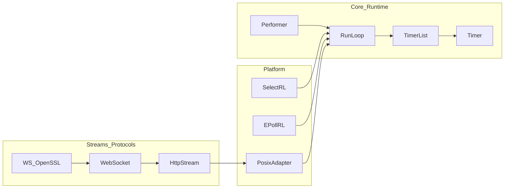
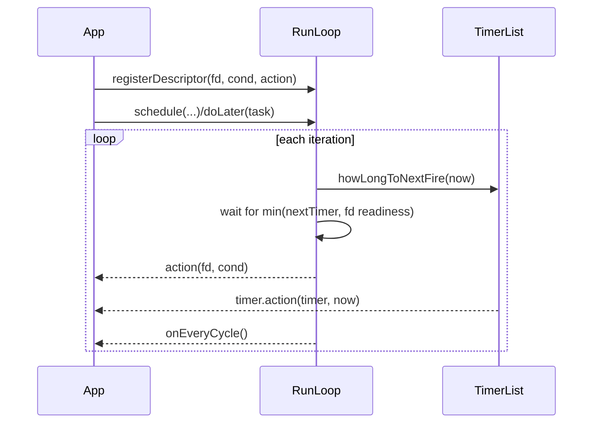
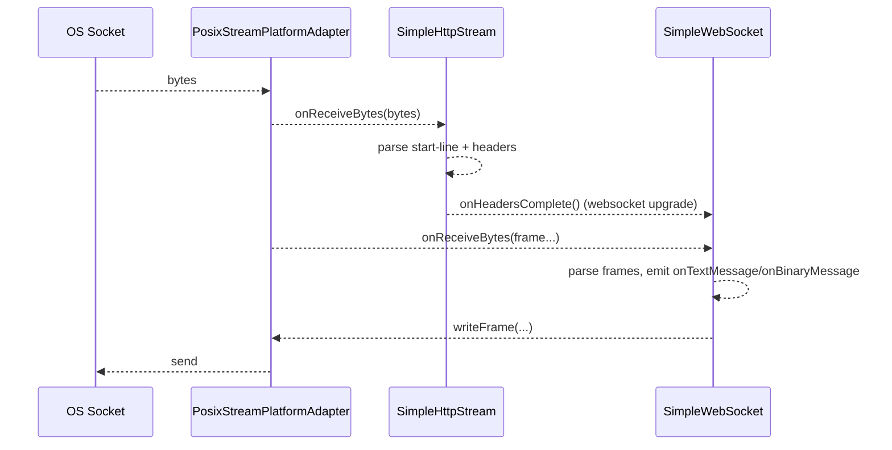

zenomt Foundation Library — Overview
===================================

This library is a lightweight C++11 foundation for building event‑driven applications, with emphasis on networking. It provides:

- Event loop abstractions with timers and descriptor readiness
- A simple performer for cross‑thread task handoff
- Stream adapters to integrate protocol logic with OS sockets
- Minimal HTTP header/body parsing and a simple WebSocket server
- Utility types: reference‑counted base, retainers, containers, checksums, URI parsing, etc.

Key Namespaces
- com::zenomt: Core runtime (run loops, timers, memory, utilities)
- com::zenomt::websock: HTTP parsing and simple WebSocket server
- com::zenomt::rtmfp: Network `Address` utilities

High‑Level Architecture



Concepts at a Glance

- RunLoop: Multiplexes I/O readiness, timers, and deferred tasks. Implementations include `SelectRunLoop` (portable) and `EPollRunLoop` (Linux).
- Timer/TimerList: Priority queue of timers with optional recurrence and catch‑up semantics.
- Performer: Thread‑safe queue signaling into a `RunLoop` via a pipe for cross‑thread execution.
- IStreamPlatformAdapter: Bridges protocol logic to an underlying stream (socket). `PosixStreamPlatformAdapter` is the POSIX implementation.
- SimpleHttpStream: Parses an HTTP request header block (server‑side perspective) before streaming a body.
- SimpleWebSocket: Implements a simple server‑side WebSocket (no TLS). `SimpleWebSocket_OpenSSL` supplies SHA‑1 for the handshake.
- Utilities: `Object` (refcounted base), `Retainer`, `List` (intrusive‑style list by handle), `IndexSet`, `RateTracker`, `Checksums`, `Hex`, `URIParse`, `Address`, `Priority`, `WriteReceipt`.

Event Flow (RunLoop)



Streams/Protocol Flow



When to Use What

- Use `RunLoops.hpp::PreferredRunLoop` to get an optimal default for your OS.
- Use `Timer`/`TimerList` for scheduling and recurring tasks with catch‑up control.
- Use `Performer` to safely run work on the loop thread from another thread.
- Use `PosixStreamPlatformAdapter` to connect protocol objects to a socket and a `RunLoop`.
- Use `SimpleWebSocket_OpenSSL` for SHA‑1 in the WebSocket handshake if OpenSSL is available; otherwise, provide your own `SimpleWebSocket::sha1`.

Quick Example

```cpp
#include <zenomt/RunLoops.hpp>
#include <zenomt/Timer.hpp>

using namespace com::zenomt;

int main() {
  PreferredRunLoop loop;

  auto timer = loop.schedule(Timer::makeAction([&](Time now){
    // do periodic work
    loop.stop();
  }), loop.getCurrentTime() + 0.5, 0.5 /*recur*/);

  loop.run();
  return 0;
}
```

Next Steps
- See `runloop.md` for deeper RunLoop and Timer details
- See `streams.md` for stream adapters, HTTP, and WebSocket
- See `memory.md` for reference counting and retainers
- See `utilities.md` for helper types and algorithms


