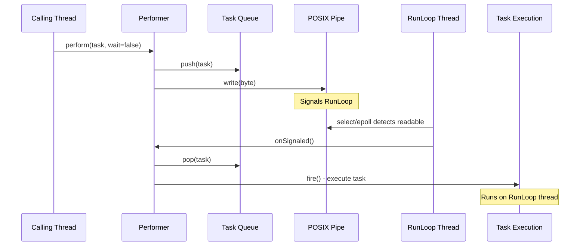
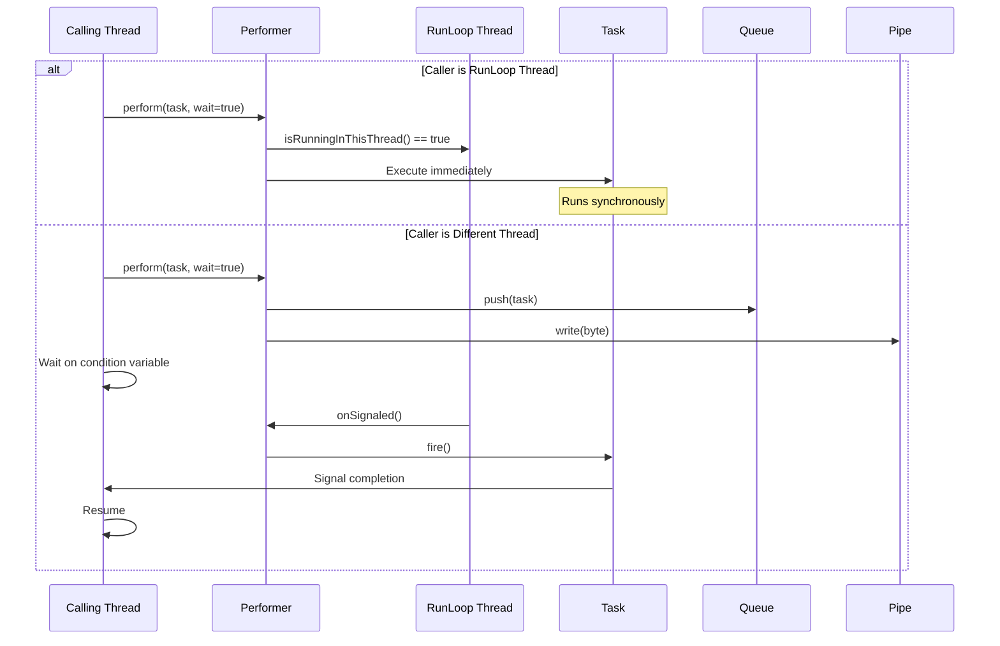
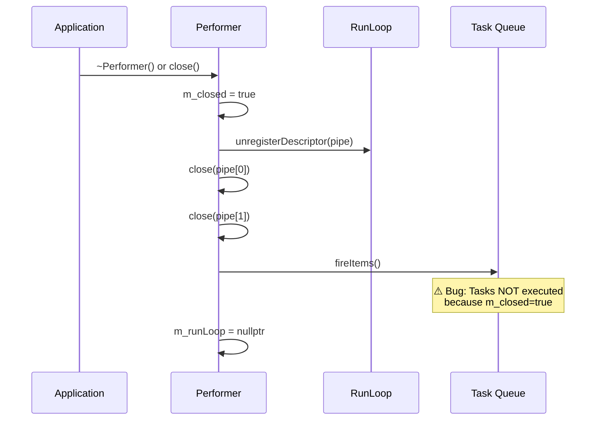
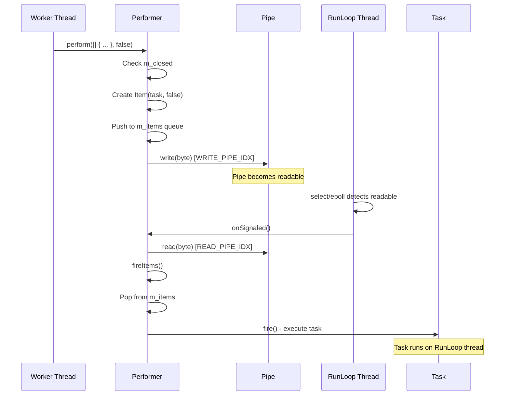
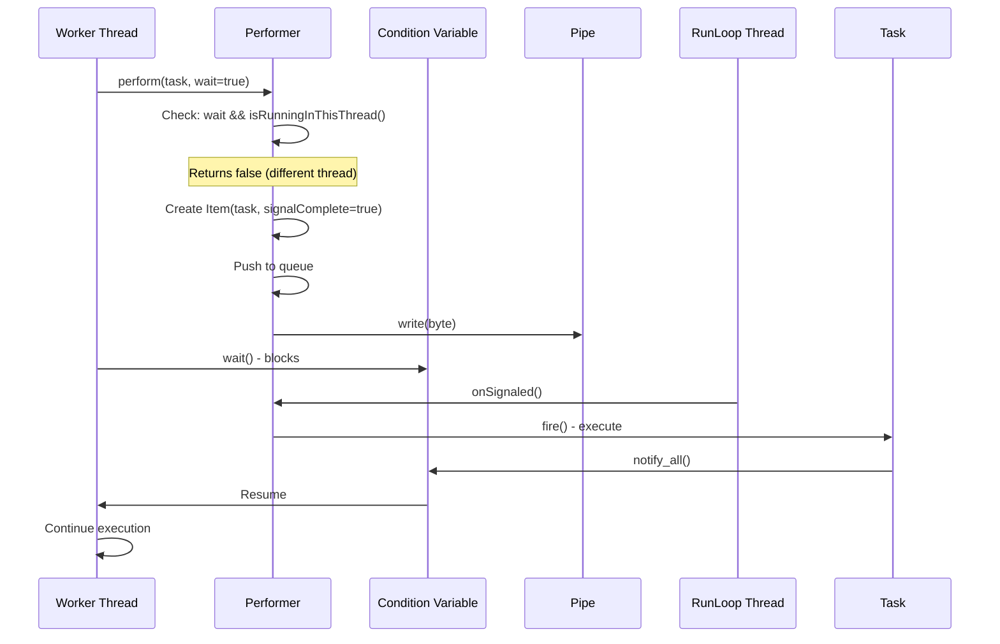
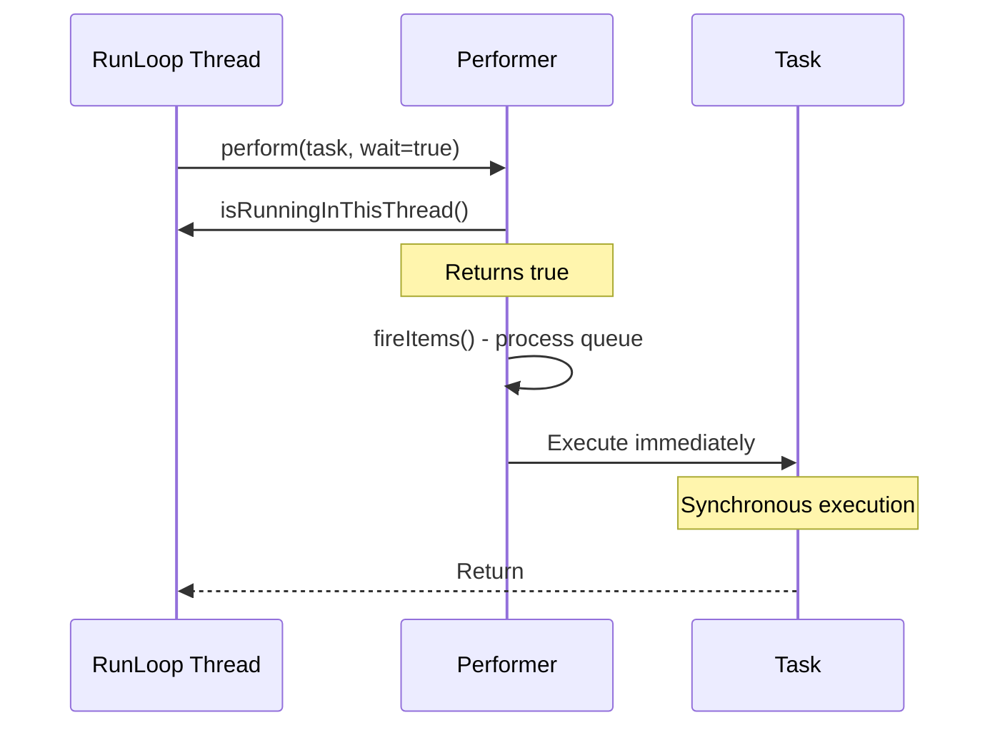
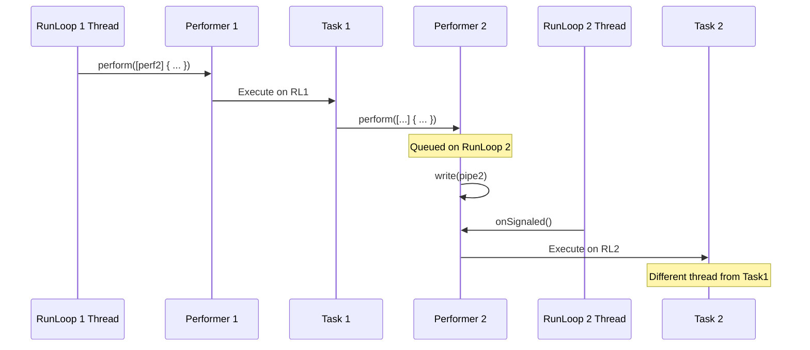
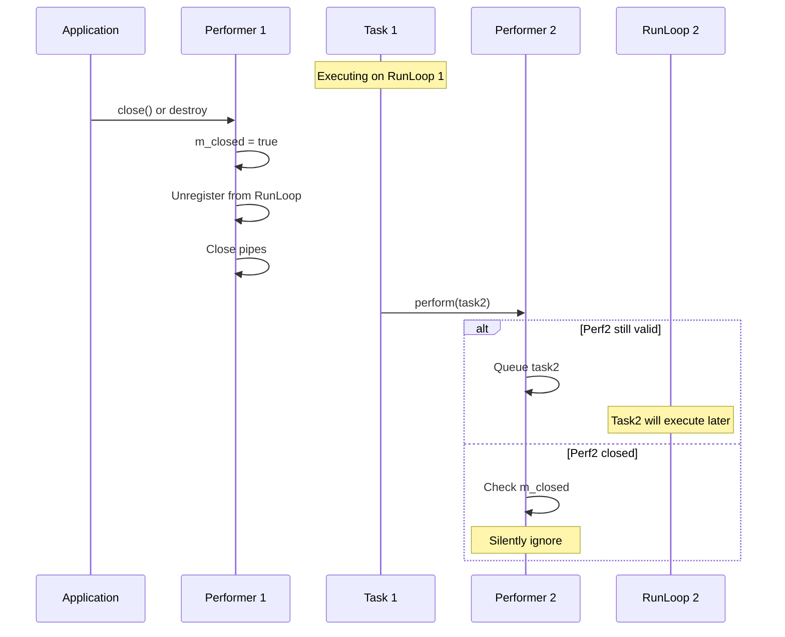
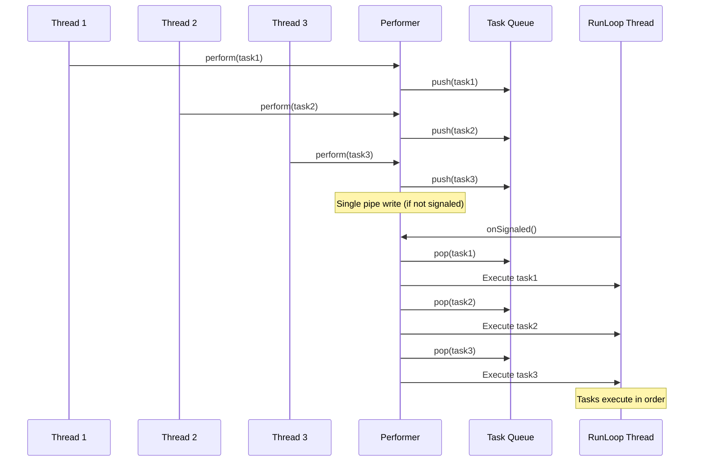

# Performer: Comprehensive Documentation

**Date:** 2024

## Overview

`Performer` provides thread-safe cross-thread task execution by allowing any thread to schedule work that executes on a `RunLoop`'s thread. It uses a POSIX pipe to signal the RunLoop when tasks are available.

---

## Table of Contents

1. [Architecture](#architecture)
2. [Thread Model](#thread-model)
3. [Lifecycle Management](#lifecycle-management)
4. [Interaction Diagrams](#interaction-diagrams)
5. [API Reference](#api-reference)
6. [Usage Patterns](#usage-patterns)
7. [Common Pitfalls](#common-pitfalls)
8. [Best Practices](#best-practices)

---

## Architecture

### Components

```
┌─────────────┐
│   Thread A  │  (Any thread)
└──────┬──────┘
       │ perform(task)
       ▼
┌─────────────────┐
│    Performer    │
│  - m_items      │  (Queue of tasks)
│  - m_pipe[2]    │  (POSIX pipe)
│  - m_runLoop    │  (Raw pointer)
└──────┬──────────┘
       │ write(pipe)
       ▼
┌─────────────────┐
│    RunLoop      │  (Thread B)
│  - Descriptors  │
│  - Timers       │
└──────┬──────────┘
       │ onSignaled()
       │ fireItems()
       ▼
┌─────────────┐
│    Task     │  (Executes on RunLoop thread)
└─────────────┘
```

### Key Design Decisions

1. **Pipe-based signaling**: Uses POSIX pipe for cross-thread wake-up
2. **Queue-based execution**: Tasks are queued and executed in order
3. **Raw pointer to RunLoop**: No shared ownership (potential issue)
4. **Thread-safe queue**: Uses mutex to protect task queue

---

## Thread Model

### Execution Context

**Critical Rule:** All Performer tasks execute on the RunLoop's thread, not the calling thread.

### Thread Flow



### Synchronous Execution (wait=true)



---

## Lifecycle Management

### Construction

```cpp
Performer performer(runLoop);
```

**What happens:**
1. Creates POSIX pipe (`pipe(m_pipe)`)
2. Registers pipe read end with RunLoop
3. Sets up callback: `[this] { this->onSignaled(); }`

### Destruction



**Current Bug:** Tasks queued before `close()` are not executed because `fireItems()` checks `if(not m_closed)` which is false.

### Recommended Destruction Order

```cpp
// Correct order
performer->close();  // Execute queued tasks
runLoop->clear();    // Clear timers/descriptors
// Now safe to destroy both
```

---

## Interaction Diagrams

### Basic Async Perform



### Sync Perform from Different Thread



### Sync Perform from RunLoop Thread



### Nested Performer Calls



### Destruction During Task Execution



### Multiple Tasks Queued



---

## API Reference

### Constructor

```cpp
Performer(RunLoop *runLoop);
```

**Parameters:**
- `runLoop`: Pointer to RunLoop (not owned, must outlive Performer)

**Throws:**
- `std::bad_alloc` if pipe creation fails (if exceptions enabled)
- Calls `abort()` if pipe creation fails (if exceptions disabled)

**Thread Safety:**
- Must be called before RunLoop starts running
- Not thread-safe (call from single thread during setup)

### perform()

```cpp
void perform(const Task &task, bool wait = false);
```

**Parameters:**
- `task`: Function to execute on RunLoop thread
- `wait`: If `true`, block until task completes

**Behavior:**

| Scenario | Execution | Thread |
|----------|-----------|--------|
| `wait=false`, any thread | Queued, async | RunLoop thread |
| `wait=true`, RunLoop thread | Immediate, sync | RunLoop thread |
| `wait=true`, other thread | Queued, blocks caller | RunLoop thread |

**Returns:**
- Nothing (void)

**Thread Safety:**
- Thread-safe: Can be called from any thread
- Safe to call concurrently from multiple threads

**Edge Cases:**
- If `m_closed == true`: Silently ignores (returns immediately)
- If `m_runLoop == nullptr`: Undefined behavior (use-after-free)

### close()

```cpp
void close();
```

**Effects:**
1. Sets `m_closed = true`
2. Unregisters pipe from RunLoop
3. Closes pipe file descriptors
4. Calls `fireItems()` (but tasks don't execute due to bug)
5. Sets `m_runLoop = nullptr`

**Thread Safety:**
- Not thread-safe (should be called when RunLoop is not running)
- Safe to call multiple times (idempotent)

**Current Bug:**
- Tasks queued before `close()` are not executed
- Should execute tasks before setting `m_closed = true`

### Destructor

```cpp
~Performer();
```

**Effects:**
- Calls `close()`
- Inherits all issues from `close()`

---

## Usage Patterns

### Pattern 1: Worker Thread to Main Thread

```cpp
// Main thread
PreferredRunLoop mainLoop;
Performer mainPerformer(&mainLoop);

std::thread worker([&mainPerformer]() {
    // Do work in worker thread
    auto result = computeSomething();
    
    // Send result to main thread
    mainPerformer.perform([result]() {
        // This runs on main thread
        processResult(result);
    });
});

mainLoop.run();
```

### Pattern 2: Synchronous Cross-Thread Call

```cpp
std::atomic<int> result{0};

std::thread worker([&mainPerformer, &result]() {
    mainPerformer.perform([&result]() {
        result = getValueFromMainThread();
    }, true);  // Wait for completion
    
    // Now result is available
    useResult(result);
});
```

### Pattern 3: Periodic Updates from Worker

```cpp
std::thread worker([&mainPerformer]() {
    while(running) {
        auto data = collectData();
        
        mainPerformer.perform([data]() {
            updateUI(data);
        });
        
        std::this_thread::sleep_for(100ms);
    }
});
```

### Pattern 4: Bidirectional Communication

```cpp
// Thread 1
PreferredRunLoop loop1;
Performer perf1(&loop1);

// Thread 2
PreferredRunLoop loop2;
Performer perf2(&loop2);

// Thread 1 sends to Thread 2
perf1.perform([&perf2]() {
    perf2.perform([]() {
        // Runs on Thread 2
    });
});

// Thread 2 sends to Thread 1
perf2.perform([&perf1]() {
    perf1.perform([]() {
        // Runs on Thread 1
    });
});
```

### Pattern 5: Task Chaining

```cpp
performer.perform([&performer]() {
    // Task 1
    auto result = step1();
    
    performer.perform([result, &performer]() {
        // Task 2 (runs after Task 1)
        auto result2 = step2(result);
        
        performer.perform([result2]() {
            // Task 3 (runs after Task 2)
            step3(result2);
        });
    });
});
```

---

## Common Pitfalls

### Pitfall 1: Destroying Performer Before Tasks Execute

```cpp
// ❌ WRONG
performer.perform([]() {
    // This may never execute!
});
delete performer;  // Tasks lost
```

**Fix:**
```cpp
// ✅ CORRECT
performer.perform([]() {
    // ...
});
// Wait for RunLoop to process
runLoop->run(0.1);  // Give it time
performer->close();
```

### Pitfall 2: Use-After-Free with RunLoop

```cpp
// ❌ WRONG
RunLoop* loop = new PreferredRunLoop();
Performer perf(loop);
delete loop;  // RunLoop destroyed
perf.perform([]() {});  // Undefined behavior!
```

**Fix:**
```cpp
// ✅ CORRECT
auto loop = std::make_shared<PreferredRunLoop>();
Performer perf(loop.get());
// Ensure loop outlives perf
```

### Pitfall 3: Deadlock with Sync Performs

```cpp
// ❌ WRONG - Potential deadlock
// Thread 1
perf1.perform([&perf2]() {
    perf2.perform([&perf1]() {
        // ...
    }, true);  // Wait
}, true);

// Thread 2
perf2.perform([&perf1]() {
    perf1.perform([&perf2]() {
        // ...
    }, true);  // Wait
}, true);
```

**Fix:**
```cpp
// ✅ CORRECT - Use async or break cycle
perf1.perform([&perf2]() {
    perf2.perform([]() {
        // ...
    }, false);  // Don't wait
}, false);
```

### Pitfall 4: Capturing Performer by Reference

```cpp
// ❌ WRONG
Performer perf(&loop);
perf.perform([&perf]() {  // Captures by reference
    perf.perform([]() {});  // May use destroyed object
});
// perf destroyed here
```

**Fix:**
```cpp
// ✅ CORRECT - Use shared_ptr or ensure lifetime
auto perf = std::make_shared<Performer>(&loop);
perf->perform([perf]() {  // Capture by value
    perf->perform([]() {});
});
```

### Pitfall 5: Assuming Tasks Execute During Close

```cpp
// ❌ WRONG
performer.perform([]() {
    cleanup();  // May never execute!
});
performer.close();  // Tasks dropped
```

**Fix:**
```cpp
// ✅ CORRECT
performer.perform([]() {
    cleanup();
});
runLoop->run(0.1);  // Ensure tasks execute
performer.close();
```

---

## Best Practices

### 1. Lifetime Management

```cpp
// Use shared_ptr for automatic lifetime management
auto runLoop = std::make_shared<PreferredRunLoop>();
auto performer = std::make_shared<Performer>(runLoop.get());

// Ensure proper destruction order
performer->close();
runLoop->clear();
```

### 2. Error Handling

```cpp
// Check if Performer is valid before use
if(performer && !performer->isClosed()) {  // Note: isClosed() doesn't exist
    performer->perform([]() {
        // ...
    });
}
```

### 3. Thread Safety

```cpp
// Performer::perform() is thread-safe
// Can be called from any thread concurrently
std::vector<std::thread> workers;
for(int i = 0; i < 10; i++) {
    workers.emplace_back([&performer, i]() {
        performer.perform([i]() {
            process(i);
        });
    });
}
```

### 4. Avoiding Deadlocks

```cpp
// Prefer async performs
performer.perform([]() {
    // Use async for nested calls
    otherPerformer.perform([]() {
        // ...
    }, false);  // Don't wait
}, false);
```

### 5. Resource Cleanup

```cpp
// Explicit cleanup before destruction
performer->close();  // Execute queued tasks
runLoop->stop();
runLoop->clear();
```

### 6. Testing

```cpp
// Use atomic flags to verify execution
std::atomic<bool> executed{false};
performer.perform([&executed]() {
    executed = true;
});

runLoop->run(0.1);
EXPECT_TRUE(executed);
```

---

## Known Issues and Workarounds

### Issue 1: Tasks Not Executed During Close

**Problem:** Tasks queued before `close()` are silently dropped.

**Workaround:**
```cpp
// Manually ensure tasks execute
while(hasPendingTasks()) {  // Custom check
    runLoop->run(0.01);
}
performer->close();
```

**Recommended Fix:** Modify `close()` to execute tasks before setting `m_closed = true`.

### Issue 2: No Null Check for RunLoop

**Problem:** `perform()` doesn't check if `m_runLoop` is null.

**Workaround:**
```cpp
// Ensure RunLoop outlives Performer
auto runLoop = std::make_shared<PreferredRunLoop>();
auto performer = std::make_shared<Performer>(runLoop.get());
// Keep runLoop alive
```

**Recommended Fix:** Add null check in `perform()`.

### Issue 3: Pipe Write Failure Ignored

**Problem:** `write()` return value is ignored.

**Workaround:**
```cpp
// Monitor Performer health
// If tasks aren't executing, Performer may be broken
```

**Recommended Fix:** Check `write()` return value and handle errors.

---

## Performance Considerations

### Overhead

- **Pipe write:** ~1-10 microseconds
- **Context switch:** ~1-10 microseconds (if different threads)
- **Task execution:** Depends on task

### Optimization Tips

1. **Batch operations:** Queue multiple tasks before signaling
2. **Avoid sync performs:** Use async when possible
3. **Minimize cross-thread calls:** Keep work on same thread when possible

### Scalability

- **Single Performer:** Handles hundreds of tasks/second
- **Multiple Performers:** Each has independent queue
- **Bottleneck:** RunLoop processing speed

---

## Thread Safety Guarantees

| Operation | Thread-Safe | Notes |
|-----------|-------------|-------|
| `perform()` | ✅ Yes | Can be called from any thread |
| `close()` | ⚠️ Partial | Should be called when RunLoop not running |
| `~Performer()` | ⚠️ Partial | Should be called when RunLoop not running |
| Task execution | ✅ Yes | Always on RunLoop thread |

---

## Summary

**Key Takeaways:**

1. ✅ Tasks **always** execute on RunLoop's thread
2. ✅ `perform()` is thread-safe and can be called from any thread
3. ⚠️ Performer must outlive RunLoop (or close before RunLoop destruction)
4. ⚠️ Tasks queued before `close()` are not executed (bug)
5. ✅ Nested Performer calls work correctly
6. ⚠️ Sync performs can deadlock if not careful

**Recommended Practices:**

- Use `shared_ptr` for lifetime management
- Always call `close()` before destroying RunLoop
- Prefer async performs (`wait=false`)
- Ensure RunLoop is running when using sync performs
- Test destruction scenarios carefully

