# RunLoop: Comprehensive Documentation

**Date:** 2024

## Overview

`RunLoop` is the core event loop abstraction that multiplexes I/O readiness, timers, and deferred tasks. It provides a single-threaded event-driven programming model with efficient time management and descriptor monitoring.

---

## Table of Contents

1. [Architecture](#architecture)
2. [Implementations](#implementations)
3. [Event Loop Cycle](#event-loop-cycle)
4. [Interaction Diagrams](#interaction-diagrams)
5. [API Reference](#api-reference)
6. [Time Management](#time-management)
7. [Descriptor Management](#descriptor-management)
8. [Timer Integration](#timer-integration)
9. [Usage Patterns](#usage-patterns)
10. [Best Practices](#best-practices)

---

## Architecture

### Core Components

```
┌─────────────────────────────────────┐
│           RunLoop                   │
│  ┌───────────────────────────────┐  │
│  │      TimerList                 │  │
│  │  - Priority queue of timers   │  │
│  │  - Sorted by fire time         │  │
│  └───────────────────────────────┘  │
│  ┌───────────────────────────────┐  │
│  │   Descriptor Registry         │  │
│  │  - File descriptors           │  │
│  │  - Conditions (R/W/E)         │  │
│  │  - Actions                    │  │
│  └───────────────────────────────┘  │
│  ┌───────────────────────────────┐  │
│  │   Deferred Tasks (doLater)   │  │
│  │  - Queue of tasks             │  │
│  └───────────────────────────────┘  │
│  ┌───────────────────────────────┐  │
│  │   Time Management            │  │
│  │  - Monotonic clock            │  │
│  │  - Cached time                │  │
│  └───────────────────────────────┘  │
└─────────────────────────────────────┘
```

### Design Principles

1. **Single-threaded execution**: RunLoop runs on one thread
2. **Non-blocking I/O**: Uses select/epoll for efficient waiting
3. **Timer precision**: Microsecond-level timing with catch-up support
4. **Time caching**: Optimizes time queries within a cycle

---

## Implementations

### SelectRunLoop

**Platform:** All POSIX systems

**Characteristics:**
- Uses `select(2)` system call
- Portable across Unix-like systems
- Limited by `FD_SETSIZE` (typically 1024 file descriptors)
- Good for small to medium numbers of descriptors

**When to use:**
- Cross-platform compatibility required
- Small number of file descriptors (< 100)
- Simplicity preferred

### EPollRunLoop

**Platform:** Linux only

**Characteristics:**
- Uses `epoll(7)` system call
- Scales to thousands of file descriptors
- More efficient than select for large descriptor sets
- Edge-triggered style processing

**When to use:**
- Linux-only deployment
- Large number of file descriptors (> 100)
- Performance critical

### PreferredRunLoop

**Platform:** Automatic selection

**Characteristics:**
- Alias to `EPollRunLoop` on Linux
- Alias to `SelectRunLoop` on other platforms
- Recommended default choice

**Usage:**
```cpp
PreferredRunLoop loop;  // Best for platform
```

---

## Event Loop Cycle

### Detailed Cycle Flow

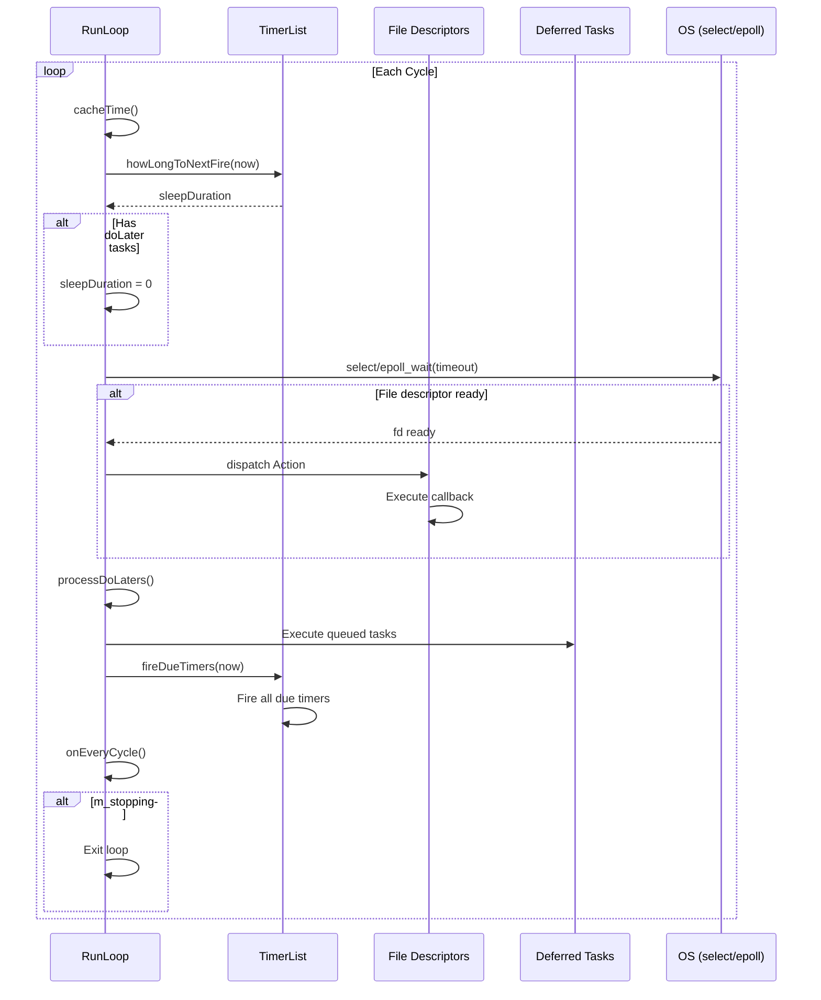

### Cycle Timing

```mermaid
gantt
    title RunLoop Cycle Timeline
    dateFormat x
    axisFormat %L ms
    
    section Cycle
    Cache Time           :0, 1
    Calculate Sleep      :1, 2
    Wait for Events      :2, 5002
    Process FDs          :5002, 5010
    Process doLater      :5010, 5015
    Fire Timers          :5015, 5020
    onEveryCycle         :5020, 5025
```

---

## Interaction Diagrams

### Basic RunLoop Execution

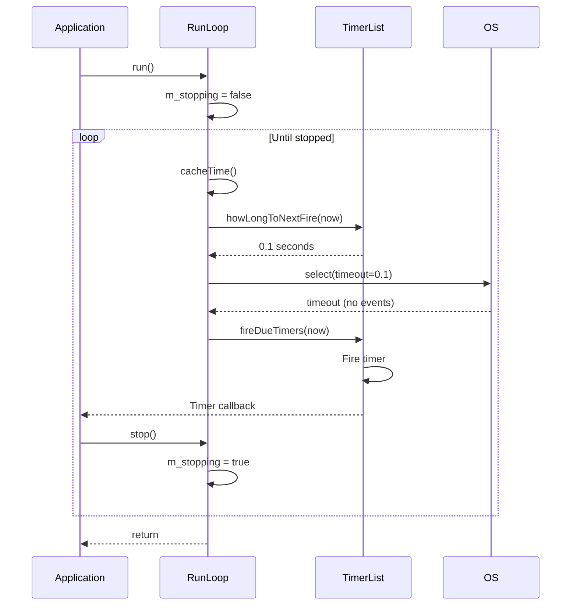

### Descriptor Registration and Events

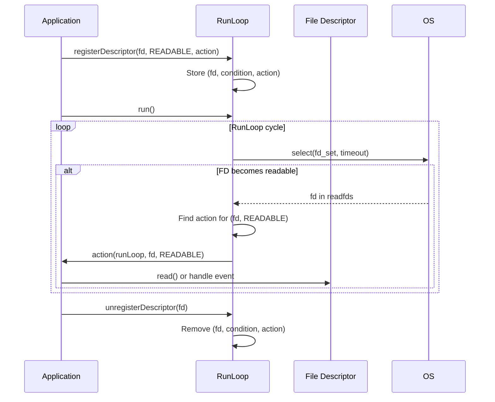

### Timer Scheduling and Firing

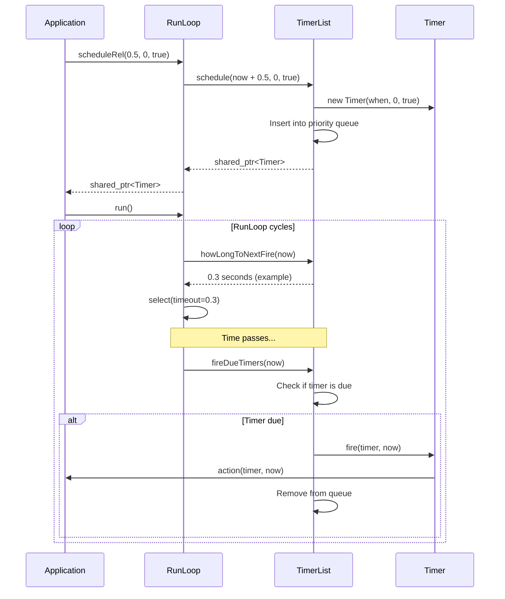

### Recurring Timer with Catch-up

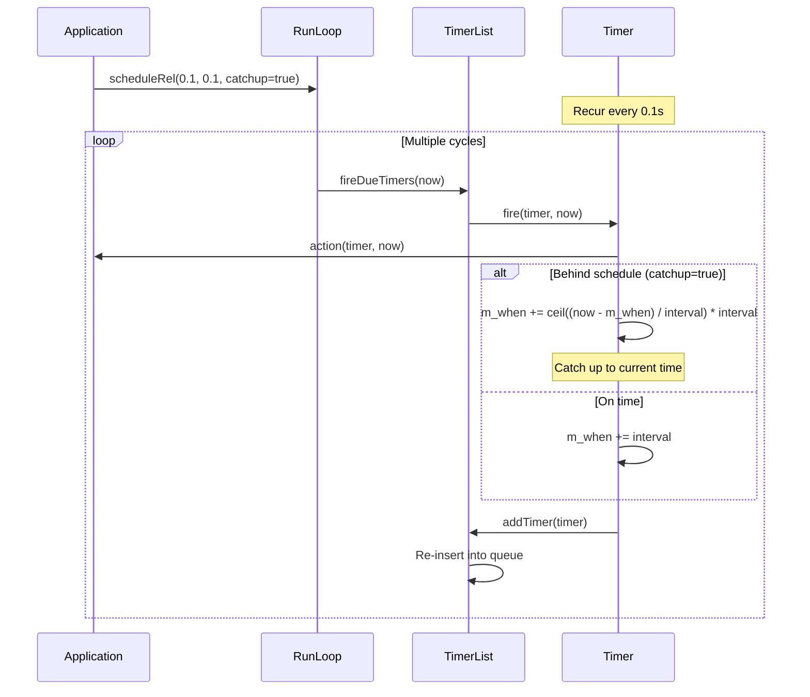

### doLater Task Execution

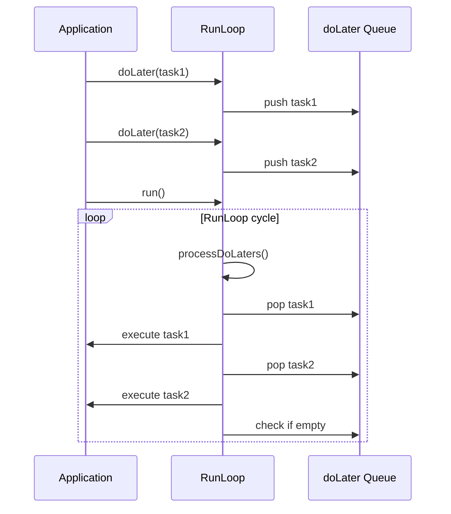

### Multiple Timers and Descriptors

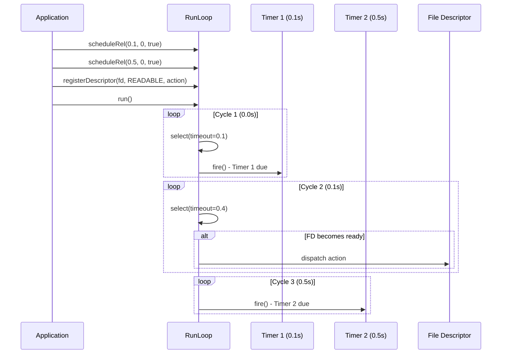

---

## API Reference

### RunLoop (Abstract Base)

#### Construction

```cpp
RunLoop(bool sharedTimeOrigin = false);
```

**Parameters:**
- `sharedTimeOrigin`: If `true`, uses epoch (0) as time origin; if `false`, uses current time

**Effects:**
- Initializes time origin
- Sets up timer list
- Initializes state

#### Descriptor Management

```cpp
virtual void registerDescriptor(int fd, Condition cond, const Action &action) = 0;
virtual void registerDescriptor(int fd, Condition cond, const Task &task);
virtual void unregisterDescriptor(int fd, Condition cond) = 0;
virtual void unregisterDescriptor(int fd);  // Unregister all conditions
```

**Conditions:**
- `READABLE`: File descriptor is readable
- `WRITABLE`: File descriptor is writable
- `EXCEPTION`: Exception condition (error, out-of-band data)

**Thread Safety:**
- Must be called from RunLoop thread or before `run()` starts
- Not thread-safe

#### Timer Scheduling

```cpp
std::shared_ptr<Timer> schedule(Time when, Duration recurInterval = 0, bool catchup = true);
std::shared_ptr<Timer> schedule(const Timer::Action &action, Time when, Duration recurInterval = 0, bool catchup = true);

std::shared_ptr<Timer> scheduleRel(Duration delta, Duration recurInterval = 0, bool catchup = true);
std::shared_ptr<Timer> scheduleRel(const Timer::Action &action, Duration delta, Duration recurInterval = 0, bool catchup = true);
```

**Parameters:**
- `when`: Absolute time to fire
- `delta`: Relative time from now
- `recurInterval`: Recurrence interval (0 = one-shot)
- `catchup`: If `true`, catch up if behind schedule

**Returns:**
- `shared_ptr<Timer>` for control

#### Deferred Tasks

```cpp
virtual void doLater(const Task &task);
```

**Effects:**
- Queues task for execution in next cycle
- Executes after descriptor events and before timers
- Useful for breaking up long operations

#### Control

```cpp
virtual void run(Duration runInterval = INFINITY, Duration minSleep = 0) = 0;
virtual void stop();
virtual bool isRunningInThisThread() const = 0;
```

**Parameters:**
- `runInterval`: Maximum time to run (default: infinite)
- `minSleep`: Minimum sleep time between cycles

**Effects:**
- `run()`: Starts event loop (blocks until `stop()`)
- `stop()`: Sets flag to exit loop
- `isRunningInThisThread()`: Checks if called from RunLoop thread

#### Time Management

```cpp
virtual Time getCurrentTime() const;
virtual Time getCurrentTimeNoCache() const;
```

**Returns:**
- `getCurrentTime()`: Cached time (fast, use within cycle)
- `getCurrentTimeNoCache()`: Fresh time (slower, accurate)

#### Cleanup

```cpp
virtual void clear();
```

**Effects:**
- Clears all timers
- Clears deferred tasks
- Does not unregister descriptors (call `unregisterDescriptor()` first)

#### Callbacks

```cpp
Task onEveryCycle;
```

**Effects:**
- Called every cycle after processing events
- Useful for periodic checks or maintenance

---

## Time Management

### Time Origin

```cpp
RunLoop loop;  // Origin = current time
RunLoop loop2(true);  // Origin = epoch (0)
```

**Use cases:**
- Shared origin: Synchronize multiple RunLoops
- Default origin: Independent timing

### Time Caching

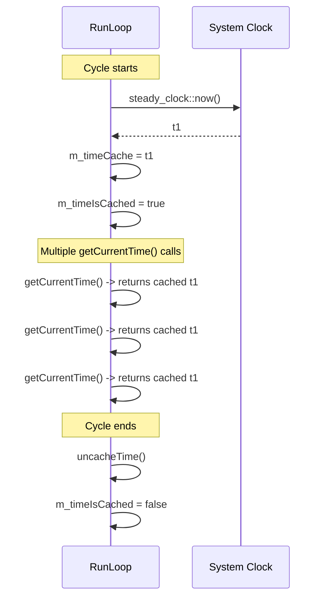

**Benefits:**
- Reduces system calls
- Consistent time within cycle
- Better performance

**When to use:**
- `getCurrentTime()`: Within RunLoop cycle (fast)
- `getCurrentTimeNoCache()`: Between cycles or when accuracy critical

---

## Descriptor Management

### Registration Flow

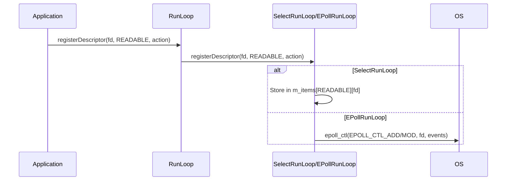

### Event Dispatch

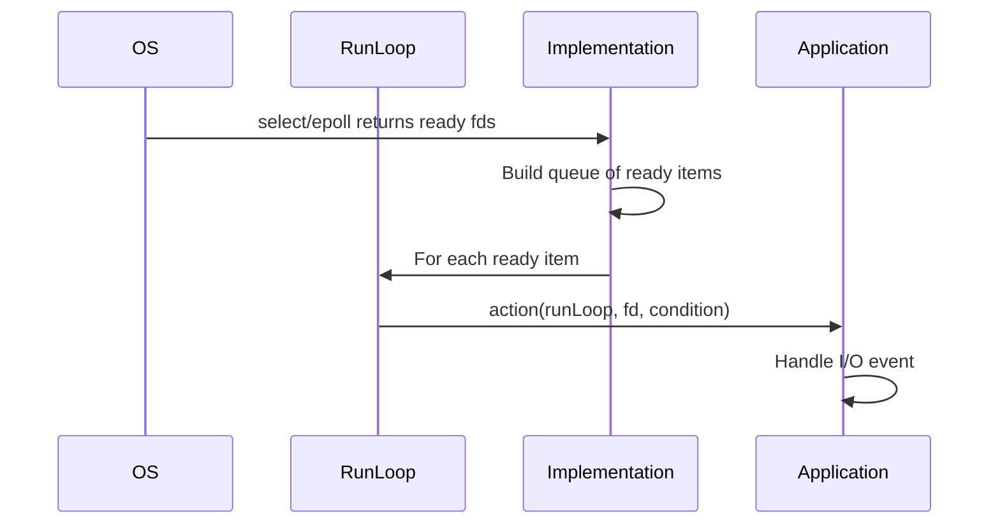

### Unregistration

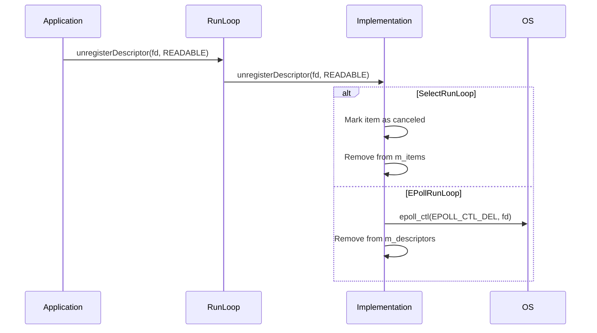

---

## Timer Integration

### Timer Lifecycle

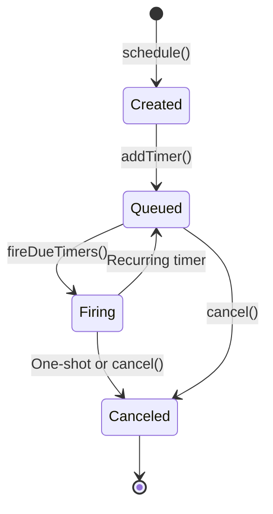

### Catch-up Behavior

**With catchup=true:**
```cpp
// Timer scheduled for 0.0s, interval 0.1s
// System busy, now = 0.35s when timer fires

// First fire: 0.35s (catch up)
// Next fire: 0.4s (0.35 + 0.1 - catch up done)
// Then: 0.5s, 0.6s, etc.
```

**With catchup=false:**
```cpp
// Timer scheduled for 0.0s, interval 0.1s
// System busy, now = 0.35s when timer fires

// First fire: 0.35s
// Next fire: 0.45s (0.35 + 0.1, no catch up)
// Then: 0.55s, 0.65s, etc. (always 0.1s from last fire)
```

---

## Usage Patterns

### Pattern 1: Basic Event Loop

```cpp
PreferredRunLoop loop;

// Register socket
int sock = socket(AF_INET, SOCK_STREAM, 0);
loop.registerDescriptor(sock, RunLoop::READABLE, [&](RunLoop*, int fd, RunLoop::Condition) {
    // Handle read
});

loop.run();
```

### Pattern 2: Timer-Based Operations

```cpp
PreferredRunLoop loop;

auto timer = loop.scheduleRel(1.0, 0, true);
timer->action = Timer::makeAction([&](Time now) {
    // Do something
    loop.stop();
});

loop.run();
```

### Pattern 3: Periodic Tasks

```cpp
PreferredRunLoop loop;

// Every 100ms
auto timer = loop.scheduleRel(0.1, 0.1, true);
timer->action = Timer::makeAction([&](Time now) {
    // Periodic work
});
```

### Pattern 4: Breaking Up Long Operations

```cpp
PreferredRunLoop loop;

void processLargeData(const Data& data) {
    size_t processed = 0;
    
    auto processChunk = [&]() {
        // Process 1000 items
        for(size_t i = 0; i < 1000 && processed < data.size(); i++) {
            process(data[processed++]);
        }
        
        if(processed < data.size()) {
            loop.doLater(processChunk);  // Continue in next cycle
        }
    };
    
    loop.doLater(processChunk);
}
```

### Pattern 5: Multiple Timers

```cpp
PreferredRunLoop loop;

// Fast timer: 10ms
auto fast = loop.scheduleRel(0.01, 0.01, true);
fast->action = Timer::makeAction([&](Time now) {
    // Frequent updates
});

// Slow timer: 1s
auto slow = loop.scheduleRel(1.0, 1.0, true);
slow->action = Timer::makeAction([&](Time now) {
    // Periodic reports
});
```

---

## Best Practices

### 1. Single Thread

```cpp
// ✅ CORRECT
std::thread loopThread([&]() {
    loop.run();  // Run on dedicated thread
});

// ❌ WRONG
loop.run();  // In thread 1
loop.registerDescriptor(...);  // In thread 2 - undefined behavior
```

### 2. Descriptor Lifecycle

```cpp
// ✅ CORRECT
int fd = socket(...);
loop.registerDescriptor(fd, RunLoop::READABLE, action);
// ... use fd ...
loop.unregisterDescriptor(fd);
close(fd);

// ❌ WRONG
close(fd);
loop.unregisterDescriptor(fd);  // Too late
```

### 3. Timer Management

```cpp
// ✅ CORRECT
auto timer = loop.scheduleRel(1.0, 0, true);
timer->action = Timer::makeAction([&](Time now) {
    // Work
});
// Timer auto-cleans up when done

// ❌ WRONG
auto timer = loop.scheduleRel(1.0, 0, true);
// Forget to set action - timer fires with null action
```

### 4. Time Usage

```cpp
// ✅ CORRECT - Within cycle
loop.registerDescriptor(fd, RunLoop::READABLE, [&](RunLoop*, int, RunLoop::Condition) {
    Time now = loop.getCurrentTime();  // Fast, cached
    // Use now
});

// ✅ CORRECT - Between cycles
Time now = loop.getCurrentTimeNoCache();  // Accurate
```

### 5. Long-Running Operations

```cpp
// ✅ CORRECT - Break up work
void processData(const Data& data) {
    size_t i = 0;
    auto chunk = [&]() {
        for(size_t j = 0; j < 100 && i < data.size(); j++) {
            process(data[i++]);
        }
        if(i < data.size()) {
            loop.doLater(chunk);
        }
    };
    loop.doLater(chunk);
}

// ❌ WRONG - Blocking operation
loop.registerDescriptor(fd, RunLoop::READABLE, [](RunLoop*, int, RunLoop::Condition) {
    processHugeFile();  // Blocks RunLoop!
});
```

### 6. Cleanup

```cpp
// ✅ CORRECT
loop.stop();
// Wait for loop to finish
loop.clear();  // Clear timers/tasks
// Unregister descriptors
// Close file descriptors

// ❌ WRONG
delete &loop;  // Without cleanup
```

---

## Performance Considerations

### Time Caching Impact

- **Without caching**: ~100-1000 ns per `getCurrentTime()` call
- **With caching**: ~1-10 ns per call (100-1000x faster)

### Descriptor Limits

- **SelectRunLoop**: Limited by `FD_SETSIZE` (typically 1024)
- **EPollRunLoop**: Scales to thousands of descriptors

### Timer Overhead

- **Scheduling**: O(log n) where n = number of timers
- **Firing**: O(k) where k = number of due timers
- **Typical**: Handles thousands of timers efficiently

### Cycle Time

Typical cycle breakdown:
- Time caching: < 1 µs
- Timer calculation: < 10 µs
- System call (select/epoll): 1-1000 µs (depends on timeout)
- Event dispatch: < 1 µs per event
- Timer firing: < 1 µs per timer

---

## Thread Safety

| Operation | Thread-Safe | Notes |
|-----------|-------------|-------|
| `run()` | ❌ No | Must run on single thread |
| `registerDescriptor()` | ❌ No | Call before `run()` or from RunLoop thread |
| `schedule()` | ⚠️ Partial | Safe if RunLoop not running, otherwise call from RunLoop thread |
| `doLater()` | ⚠️ Partial | Safe if RunLoop not running, otherwise call from RunLoop thread |
| `stop()` | ✅ Yes | Can be called from any thread |
| `getCurrentTime()` | ⚠️ Partial | Safe if RunLoop not running |

---

## Common Pitfalls

### Pitfall 1: Blocking in Callbacks

```cpp
// ❌ WRONG
loop.registerDescriptor(fd, RunLoop::READABLE, [](RunLoop*, int, RunLoop::Condition) {
    sleep(1);  // Blocks entire RunLoop!
});

// ✅ CORRECT
loop.registerDescriptor(fd, RunLoop::READABLE, [](RunLoop*, int, RunLoop::Condition) {
    // Quick operation
    loop.doLater([]() {
        // Longer operation in next cycle
    });
});
```

### Pitfall 2: Forgetting to Unregister

```cpp
// ❌ WRONG
int fd = socket(...);
loop.registerDescriptor(fd, RunLoop::READABLE, action);
close(fd);  // Descriptor still registered!

// ✅ CORRECT
loop.unregisterDescriptor(fd);
close(fd);
```

### Pitfall 3: Timer Action Not Set

```cpp
// ❌ WRONG
auto timer = loop.scheduleRel(1.0, 0, true);
// Forgot to set action - fires with null action

// ✅ CORRECT
auto timer = loop.scheduleRel(1.0, 0, true);
timer->action = Timer::makeAction([&](Time now) {
    // Work
});
```

### Pitfall 4: Multiple Run() Calls

```cpp
// ❌ WRONG
std::thread t1([&]() { loop.run(); });
std::thread t2([&]() { loop.run(); });  // Undefined behavior!

// ✅ CORRECT
std::thread t([&]() { loop.run(); });
// Only one thread runs the loop
```

---

## Summary

**Key Takeaways:**

1. ✅ RunLoop is single-threaded - one thread runs `run()`
2. ✅ Use `PreferredRunLoop` for automatic platform selection
3. ✅ Time is cached within cycles for performance
4. ✅ Timers support recurrence and catch-up behavior
5. ✅ `doLater()` breaks up long operations
6. ⚠️ Always unregister descriptors before closing
7. ⚠️ Don't block in callbacks - use `doLater()`

**Recommended Practices:**

- Use `PreferredRunLoop` unless specific implementation needed
- Keep callbacks short and non-blocking
- Use `doLater()` for longer operations
- Always unregister descriptors before closing
- Set timer actions immediately after scheduling
- Use time caching (`getCurrentTime()`) within cycles

