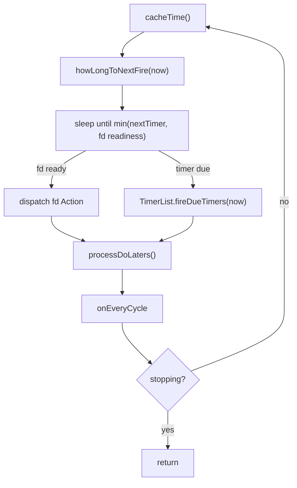

RunLoop and Timers
==================

Core Types

- `RunLoop` (abstract): multiplexing loop over file descriptors, timers, and deferred tasks.
  - Conditions: `READABLE`, `WRITABLE`, `EXCEPTION`
  - Registration: `registerDescriptor(int fd, Condition, Action)` and unregister counterparts
  - Scheduling: `schedule(...)`, `scheduleRel(...)`
  - Deferred tasks: `doLater(Task)` and `onEveryCycle`
  - Control: `run(runInterval, minSleep)`, `stop()`, `isRunningInThisThread()`
  - Time: `getCurrentTime()`, `getCurrentTimeNoCache()`

- Implementations
  - `SelectRunLoop`: portable `select(2)`‑based
  - `EPollRunLoop` (Linux): `epoll(7)`‑based
  - `PreferredRunLoop`: alias to the best implementation for the platform

- `Timer` and `TimerList`
  - `Timer(Action, when, recurInterval, catchup)` with µs‑level minimum for recurrence
  - `TimerList::schedule`, `howLongToNextFire(now)`, `fireDueTimers(now)`
  - Catch‑up: if behind schedule, recurring timers can fire multiple times per cycle if `catchup=true`

Threading Model

- A `RunLoop` generally runs on a single thread; `isRunningInThisThread()` can be used to assert affinity.
- Use `Performer` to signal tasks from other threads into the loop via an internal pipe notification.
- `doLater` may be used within callbacks to sequence work without recursion.

RunLoop Cycle



API Highlights

- Descriptor registration
  - `registerDescriptor(fd, cond, Action)` associates a callable with a readiness condition.
  - `unregisterDescriptor(fd, cond)` removes one association; `unregisterDescriptor(fd)` removes all for `fd`.

- Timers
  - Absolute: `schedule(when, recurInterval, catchup)`
  - Relative: `scheduleRel(delta, recurInterval, catchup)`
  - Handlers via `Timer::Action` or `Task`
  - Recurrence: `getRecurInterval`, `doesRecur`, `setRecurInterval`
  - Control: `cancel()`, `isCanceled()`

- Control and time
  - `run(runInterval = INFINITY, minSleep = 0)` limits total loop duration if desired
  - `stop()` sets a flag checked each cycle
  - `getCurrentTime()` uses a cached monotonic origin for efficiency

Select vs EPoll

- `SelectRunLoop`
  - Good portability; inherent fd set limits on some platforms
  - Simpler; suitable for small to medium sets of sockets

- `EPollRunLoop` (Linux)
  - Scales to many fds; edge‑triggered style processing via internal queues
  - Tracks descriptor maps per condition

Using Performer for Cross‑Thread Handoff

```cpp
#include <zenomt/RunLoops.hpp>
#include <zenomt/Performer.hpp>

using namespace com::zenomt;

PreferredRunLoop loop;
Performer perf(&loop);

std::thread worker([&]{
  perf.perform([&]{ /* safe on loop thread */ }, /*wait=*/false);
});

loop.run();
worker.join();
```

Timer Examples

```cpp
// Fire once in 100 ms
auto once = loop.scheduleRel(0.1, 0 /*no recur*/);
once->action = Timer::makeAction([&](Time now){ /* ... */ });

// Recur every 50 ms without catch‑up bursts
auto recur = loop.scheduleRel(Timer::Duration(0.05), 0.05, /*catchup=*/false);
recur->action = Timer::makeAction([&](Time now){ /* ... */ });
```

Best Practices

- Prefer capturing small state in timer actions; avoid long‑running work in loop callbacks.
- Use `minSleep` > 0 to reduce CPU when timers are very frequent but soft latency is acceptable.
- Use `doLater` to break up large tasks over multiple cycles.
- Unregister fd actions before closing their file descriptors.
