# Streams: Comprehensive Documentation

**Date:** 2024

## Overview

The streams subsystem provides platform-agnostic I/O abstraction, HTTP parsing, and WebSocket server implementation for building network protocols on top of RunLoop.

---

## Table of Contents

1. [Architecture](#architecture)
2. [IStreamPlatformAdapter](#istreamplatformadapter)
3. [PosixStreamPlatformAdapter](#posixstreamplatformadapter)
4. [HeaderBodyStream](#headerbodystream)
5. [SimpleHttpStream](#simplehttpstream)
6. [SimpleWebSocket](#simplewebsocket)
7. [Interaction Diagrams](#interaction-diagrams)
8. [API Reference](#api-reference)
9. [Usage Patterns](#usage-patterns)
10. [Best Practices](#best-practices)

---

## Architecture

### Component Hierarchy

```
┌─────────────────────────────────────┐
│  IStreamPlatformAdapter (interface) │
└──────────────┬──────────────────────┘
               │ implements
               ▼
┌─────────────────────────────────────┐
│  PosixStreamPlatformAdapter          │
│  - POSIX socket integration         │
│  - RunLoop integration              │
│  - Buffering                        │
└──────────────┬──────────────────────┘
               │ used by
               ▼
┌─────────────────────────────────────┐
│  HeaderBodyStream (base)            │
│  - Header/body separation           │
│  - Write buffering                  │
└──────────────┬──────────────────────┘
               │ extends
               ▼
┌─────────────────────────────────────┐
│  SimpleHttpStream                   │
│  - HTTP header parsing              │
│  - Request handling                 │
└──────────────┬──────────────────────┘
               │ extends
               ▼
┌─────────────────────────────────────┐
│  SimpleWebSocket                    │
│  - WebSocket frames                 │
│  - Message handling                 │
└─────────────────────────────────────┘
```

### Data Flow

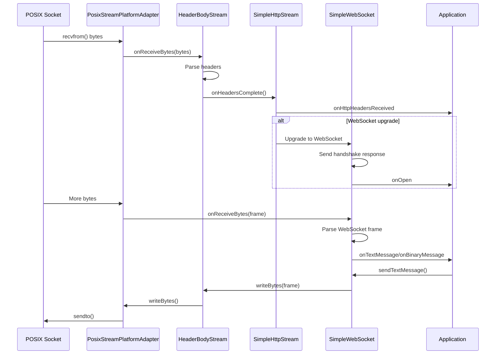

---

## IStreamPlatformAdapter

### Overview

Abstract interface for stream I/O, allowing protocol implementations to work with any platform (POSIX, Windows, etc.).

### API Reference

#### Time

```cpp
virtual Time getCurrentTime() = 0;
```

**Returns:** Current time for protocol timestamps

#### Writability Notification

```cpp
using onwritable_f = std::function<bool(void)>;
virtual void notifyWhenWritable(const onwritable_f &onwritable) = 0;
```

**Behavior:**
- Registers callback for when stream is writable
- Callback returns `false` to stop notifications
- Called repeatedly while writable

#### Receive Callback

```cpp
using onreceivebytes_f = std::function<bool(const void *bytes, size_t len)>;
virtual void setOnReceiveBytesCallback(const onreceivebytes_f &onreceivebytes) = 0;
```

**Behavior:**
- Sets callback for incoming data
- Callback returns `false` to stop receiving
- Called with data as it arrives

#### Close Callback

```cpp
virtual void setOnStreamDidCloseCallback(const Task &onstreamdidclose) = 0;
```

**Behavior:**
- Called when stream closes (error or normal)

#### Deferred Tasks

```cpp
virtual void doLater(const Task &task) = 0;
```

**Behavior:**
- Schedules task for later execution
- Only executes if stream still open

#### Writing

```cpp
virtual bool writeBytes(const void *bytes, size_t len) = 0;
```

**Returns:** `true` on success, `false` on failure

**Requirements:**
- Must accept any length
- May buffer internally
- Should be called from `onwritable` callback for best performance

#### Client Closed

```cpp
virtual void onClientClosed() = 0;
```

**Behavior:**
- Called by protocol when client closes
- Platform should clean up resources

---

## PosixStreamPlatformAdapter

### Overview

POSIX implementation of `IStreamPlatformAdapter`, integrating sockets with RunLoop for efficient I/O.

### Architecture

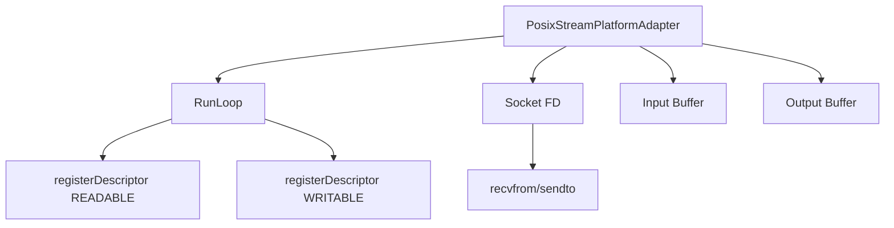

### API Reference

#### Construction

```cpp
PosixStreamPlatformAdapter(
    RunLoop *runloop = nullptr,
    int unsent_lowat = 4096,
    size_t writeSizePerSelect = 2048
);
```

**Parameters:**
- `runloop`: RunLoop to attach to (can be set later)
- `unsent_lowat`: TCP_NOTSENT_LOWAT value (backpressure)
- `writeSizePerSelect`: Max bytes to write per cycle

#### Attachment

```cpp
void attachToRunLoop(RunLoop *runloop);
void detachFromRunLoop();
```

**Behavior:**
- `attachToRunLoop()`: Registers socket with RunLoop
- `detachFromRunLoop()`: Unregisters socket

#### Socket Management

```cpp
bool setSocketFd(int fd);
int getSocketFd() const;
```

**Behavior:**
- `setSocketFd()`: Sets socket, configures non-blocking, TCP options
- `getSocketFd()`: Returns current socket (-1 if none)

#### Cleanup

```cpp
void close();
```

**Effects:**
- Unregisters from RunLoop
- Closes socket
- Clears buffers
- Calls `onShutdownCompleteCallback`

#### Callback

```cpp
Task onShutdownCompleteCallback;
```

**Called when:** Shutdown complete (all data sent)

### Internal Behavior

#### Read Handling

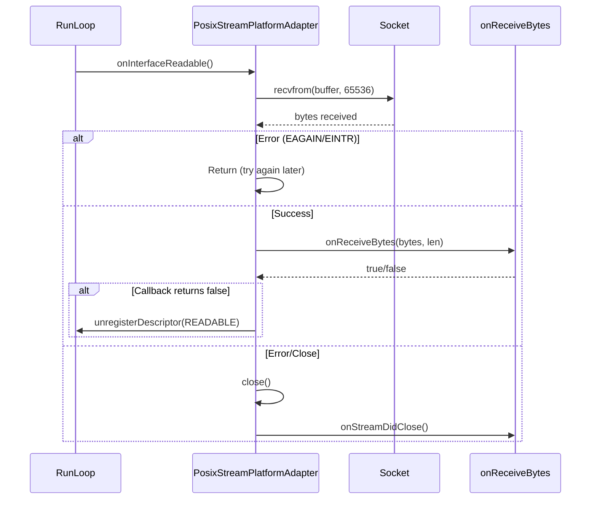

#### Write Handling

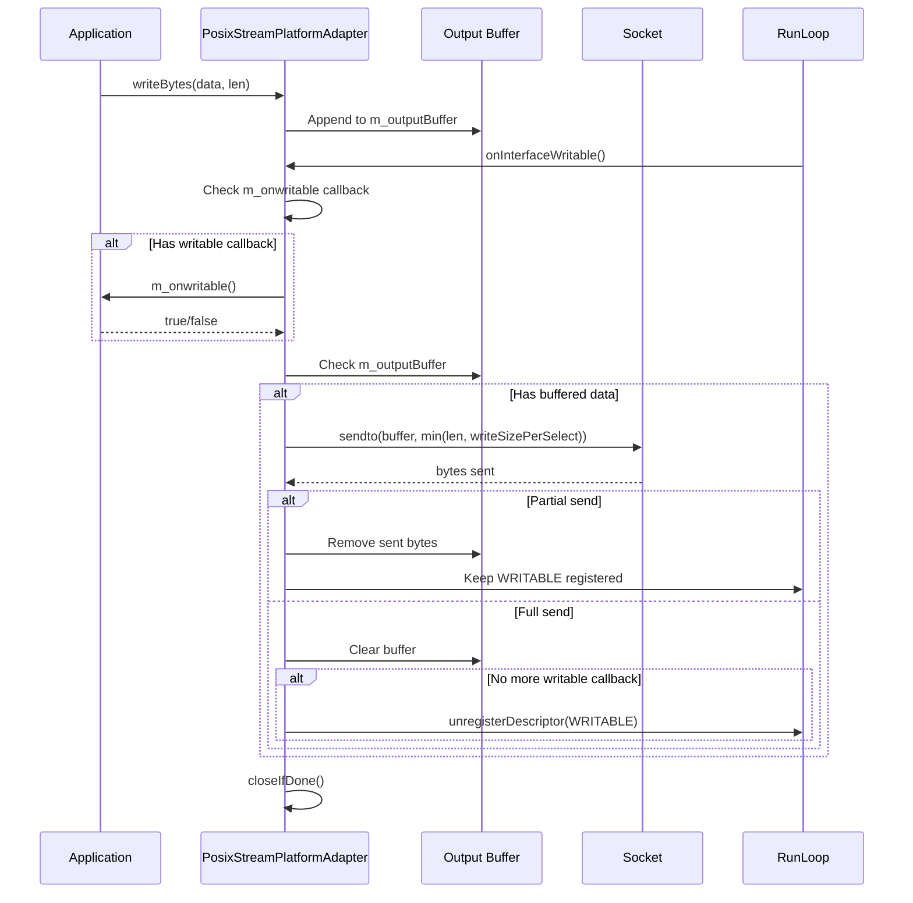

### Configuration

#### TCP Options

Automatically sets:
- `TCP_NODELAY`: Disable Nagle's algorithm
- `TCP_NOTSENT_LOWAT`: Backpressure threshold (if supported)
- `O_NONBLOCK`: Non-blocking I/O
- `F_SETNOSIGPIPE`: Disable SIGPIPE (if supported)

#### Buffering

- **Input buffer**: 65536 bytes (fixed)
- **Output buffer**: Dynamic (grows as needed)
- **Write batching**: Up to `writeSizePerSelect` per cycle

---

## HeaderBodyStream

### Overview

`HeaderBodyStream` is the base class for protocols that separate header and body portions of messages (like HTTP). It provides automatic header/body separation, write buffering, and state management for protocol implementations built on top of `IStreamPlatformAdapter`.

**Purpose:**
- Manages header/body separation for protocols like HTTP
- Provides buffering and write scheduling
- Handles state transitions (OPEN → CLOSING → ERROR)
- Simplifies protocol implementation by handling common I/O patterns

### State Machine

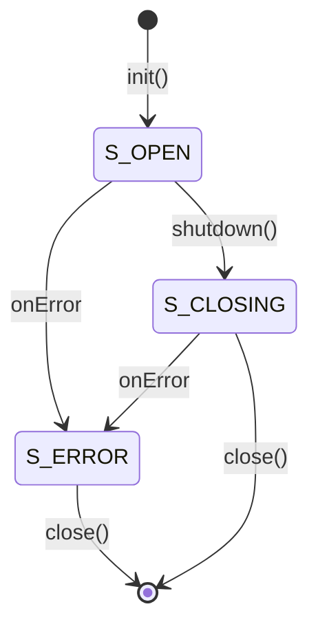

**States:**
- `S_OPEN`: Stream is open and processing data
- `S_CLOSING`: Graceful shutdown initiated
- `S_ERROR`: Error occurred, stream is closed

### API Reference

#### Construction

```cpp
HeaderBodyStream(std::shared_ptr<IStreamPlatformAdapter> platform);
```

**Parameters:**
- `platform`: Platform adapter for I/O operations

**Behavior:**
- Stores platform adapter reference
- Initializes state to `S_OPEN`
- Sets `m_headerComplete = false`

#### Initialization and Lifecycle

```cpp
virtual bool init();
virtual void close();
virtual void shutdown();
```

**Behavior:**
- `init()`: Must be called after construction. Sets up receive callback with platform adapter.
- `close()`: Closes the stream, clears callbacks, sets state to `S_ERROR`.
- `shutdown()`: Begins graceful shutdown, sets state to `S_CLOSING`.

#### Time Access

```cpp
Time getCurrentTime();
```

**Returns:** Current time from platform adapter

#### Writing

```cpp
void writeBytes(const void *bytes, size_t len);
void writeBytes(const Bytes &bytes);
void writeBytes(const std::string &s);
```

**Behavior:**
- Schedules bytes for writing
- Buffers internally if needed
- Best performance when called from `onwritable` callback
- Multiple overloads for convenience

#### Writability Notification

```cpp
using onwritable_f = IStreamPlatformAdapter::onwritable_f;
void notifyWhenWritable(const onwritable_f &onwritable);
```

**Behavior:**
- Registers callback for when stream is writable
- Callback should call `writeBytes()` to send data
- Returns `false` to stop notifications

#### Error Handling

```cpp
Task onError;
```

**Called when:** Error occurs during I/O operations

### Protected API (For Subclasses)

#### Header Processing

```cpp
virtual const uint8_t * onHeaderBytes(const uint8_t *bytes, const uint8_t *limit);
```

**Parameters:**
- `bytes`: Pointer to start of header bytes
- `limit`: Pointer to end of buffer

**Returns:** Pointer to first body byte, or `limit` if header not complete

**Behavior:**
- Called for each chunk of received data until header is complete
- Subclass should parse header and detect end (e.g., double newline)
- Return pointer to start of body when header complete
- Default implementation returns `limit` (no header processing)

**Example:**
```cpp
const uint8_t * onHeaderBytes(const uint8_t *bytes, const uint8_t *limit) override {
    // Find double newline
    const uint8_t *cursor = bytes;
    while(cursor < limit - 1) {
        if(cursor[0] == '\r' && cursor[1] == '\n' &&
           cursor[2] == '\r' && cursor[3] == '\n') {
            // Header complete, body starts at cursor + 4
            return cursor + 4;
        }
        cursor++;
    }
    return limit;  // Need more data
}
```

#### Body Processing

```cpp
virtual const uint8_t * onBodyBytes(const uint8_t *bytes, const uint8_t *limit);
```

**Parameters:**
- `bytes`: Pointer to start of body bytes
- `limit`: Pointer to end of buffer

**Returns:** Pointer to end of processed bytes

**Behavior:**
- Called after header is complete
- Subclass should process body bytes
- Return pointer to end of processed bytes
- Default implementation returns `limit` (pass through)

#### Header Completion

```cpp
virtual void onHeadersComplete();
```

**Called when:** Header block is fully received (after `onHeaderBytes` returns body pointer)

**Behavior:**
- Subclass can perform initialization based on headers
- Default implementation does nothing

### Internal Behavior

#### Header/Body Separation

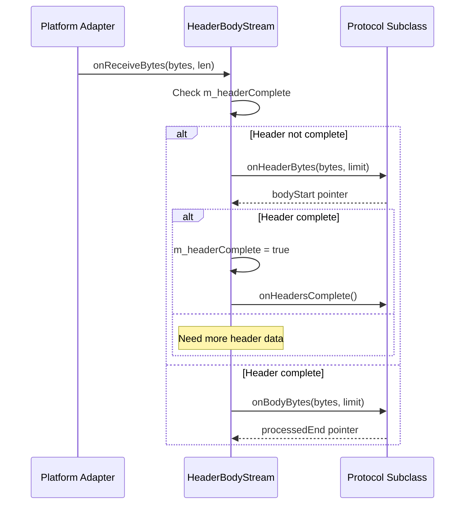

#### Write Buffering

- All writes go through `m_rawOutputBuffer`
- Buffer is flushed when writable
- Automatic scheduling via platform adapter
- Prevents blocking on write operations

#### State Management

- State transitions are automatic based on operations
- Error state prevents further operations
- Closing state allows graceful shutdown

### When to Subclass

Subclass `HeaderBodyStream` when:
- Creating new protocol parsers on top of `IStreamPlatformAdapter`
- Need header/body separation
- Want automatic write buffering and scheduling
- Building protocols similar to HTTP (header block + body)

**Examples:**
- Custom HTTP-like protocols
- RTSP-like protocols
- Any protocol with header/body structure

### Usage Pattern

```cpp
class MyProtocolStream : public HeaderBodyStream {
public:
    using HeaderBodyStream::HeaderBodyStream;

protected:
    const uint8_t * onHeaderBytes(const uint8_t *bytes, const uint8_t *limit) override {
        // Parse header until delimiter found
        const uint8_t *cursor = bytes;
        while(cursor < limit - 3) {
            if(cursor[0] == '\r' && cursor[1] == '\n' &&
               cursor[2] == '\r' && cursor[3] == '\n') {
                // Parse header block
                parseHeader(bytes, cursor);
                // Return pointer to body start
                return cursor + 4;
            }
            cursor++;
        }
        return limit;  // Need more data
    }
    
    const uint8_t * onBodyBytes(const uint8_t *bytes, const uint8_t *limit) override {
        // Process body bytes
        processBody(bytes, limit);
        return limit;  // All processed
    }
    
    void onHeadersComplete() override {
        // Headers parsed, ready for body
        // Can access parsed headers here
    }

private:
    void parseHeader(const uint8_t *start, const uint8_t *end);
    void processBody(const uint8_t *start, const uint8_t *end);
};

// Usage
auto platform = std::make_shared<PosixStreamPlatformAdapter>(&loop);
platform->setSocketFd(fd);

auto stream = std::make_shared<MyProtocolStream>(platform);
stream->onError = []() {
    // Handle error
};
stream->init();
```

### Best Practices

1. **Always call `init()`**: Required to set up receive callback
2. **Return correct pointers**: `onHeaderBytes` must return body start when header complete
3. **Handle errors**: Set `onError` callback for error handling
4. **Use `onHeadersComplete`**: Perform header-based initialization here
5. **Write from `onwritable`**: Best performance when writing from writability callback

### Common Pitfalls

1. **Forgetting `init()`**: Stream won't receive data without calling `init()`
2. **Incorrect pointer return**: Returning wrong pointer in `onHeaderBytes` causes data loss
3. **Not handling state**: Check state before operations if needed
4. **Blocking in callbacks**: Keep callbacks short and non-blocking

---

## SimpleHttpStream

### Overview

Parses HTTP request headers (server-side) and separates header block from body, providing access to request components.

### HTTP Parsing Flow

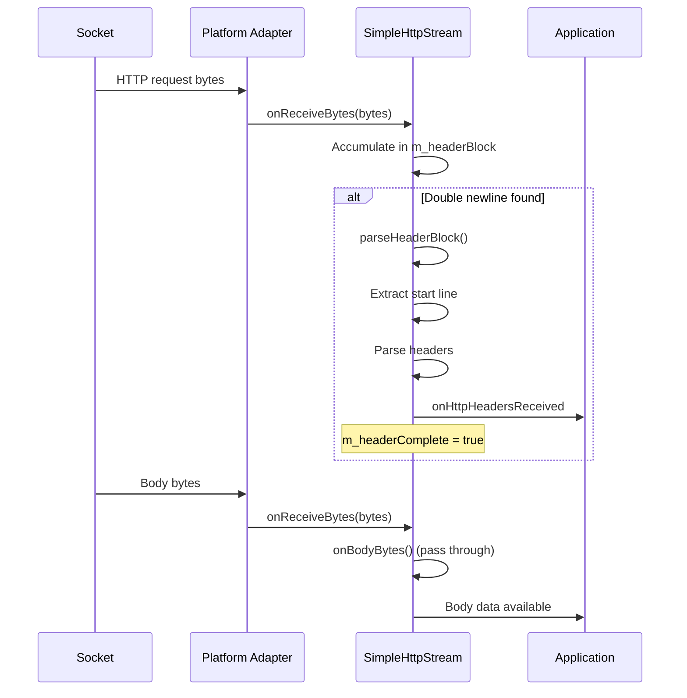

### API Reference

#### Construction

```cpp
SimpleHttpStream(std::shared_ptr<IStreamPlatformAdapter> platform);
```

#### Header Access

```cpp
std::string getStartLine() const;
bool hasHeader(const std::string &name) const;
std::string getHeader(const std::string &name) const;
std::vector<std::string> getHeaderValues(const std::string &name) const;
```

**Behavior:**
- `getStartLine()`: Returns request line (e.g., "GET /path HTTP/1.1")
- `hasHeader()`: Case-insensitive check
- `getHeader()`: Returns comma-separated values (except Set-Cookie)
- `getHeaderValues()`: Returns all values (for Set-Cookie)

#### Validation

```cpp
static bool isToken(const std::string &str);
```

**Returns:** `true` if string is valid RFC 9110 token

#### Callback

```cpp
Task onHttpHeadersReceived;
```

**Called when:** Header block fully parsed

### Header Parsing

**Format:**
```
GET /path HTTP/1.1\r\n
Header-Name: value\r\n
Another-Header: value1, value2\r\n
\r\n
[body]
```

**Features:**
- Handles `\r\n` and `\n` line endings
- Folds continuation lines
- Case-insensitive header names
- Multiple values per header

---

## SimpleWebSocket

### Overview

Server-side WebSocket implementation on top of `SimpleHttpStream`, handling handshake, frame parsing, and message events.

### WebSocket Handshake

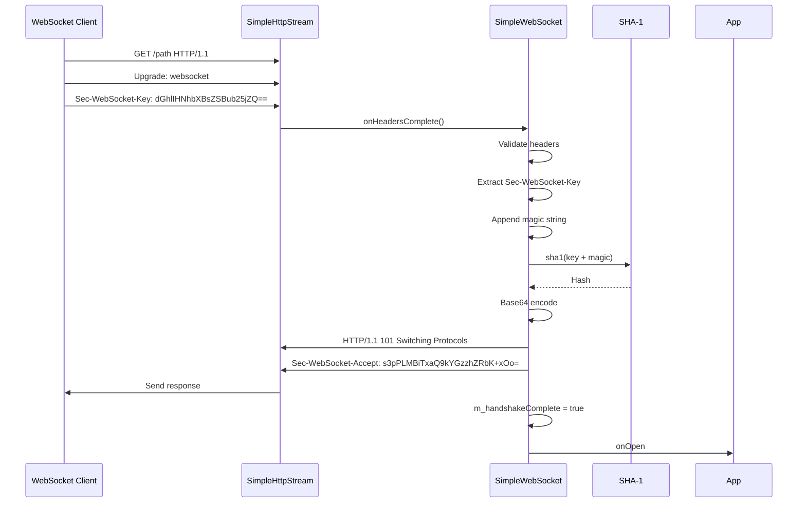

### Frame Format

```
 0                   1                   2                   3
 0 1 2 3 4 5 6 7 8 9 0 1 2 3 4 5 6 7 8 9 0 1 2 3 4 5 6 7 8 9 0 1
+-+-+-+-+-------+-+-------------+-------------------------------+
|F|R|R|R| opcode|M| Payload len |    Extended payload length    |
|I|S|S|S|  (4)  |A|     (7)     |             (16/64)           |
|N|V|V|V|       |S|             |   (if payload len==126/127)   |
| |1|2|3|       |K|             |                               |
+-+-+-+-+-------+-+-------------+ - - - - - - - - - - - - - - - +
|     Extended payload length continued, if payload len == 127  |
+ - - - - - - - - - - - - - - - +-------------------------------+
|                               |Masking-key, if MASK set to 1  |
+-------------------------------+-------------------------------+
| Masking-key (continued)       |          Payload Data         |
+-------------------------------- - - - - - - - - - - - - - - - +
:                     Payload Data continued ...                :
+ - - - - - - - - - - - - - - - - - - - - - - - - - - - - - - +
|                     Payload Data continued ...                |
+---------------------------------------------------------------+
```

### API Reference

#### Construction

```cpp
SimpleWebSocket(std::shared_ptr<IStreamPlatformAdapter> platform);
```

#### Sending Messages

```cpp
void sendTextMessage(const std::string &message);
void sendBinaryMessage(const void *bytes, size_t len);
void sendBinaryMessage(const Bytes &bytes);
```

**Behavior:**
- Creates WebSocket frame
- Sets FIN bit
- Writes to stream
- Buffers if needed

#### Control

```cpp
void cleanClose();
```

**Behavior:**
- Sends CLOSE frame
- Initiates graceful shutdown

#### Callbacks

```cpp
Task onOpen;
std::function<void(const uint8_t *bytes, size_t len)> onBinaryMessage;
std::function<void(const std::string &message)> onTextMessage;
```

**Called when:**
- `onOpen`: Handshake complete
- `onBinaryMessage`: Binary message received
- `onTextMessage`: Text message received

#### SHA-1 Requirement

```cpp
virtual void sha1(void *dst, const void *msg, size_t len) = 0;
```

**Must implement:** SHA-1 for handshake

**Provided by:** `SimpleWebSocket_OpenSSL`

### Frame Processing

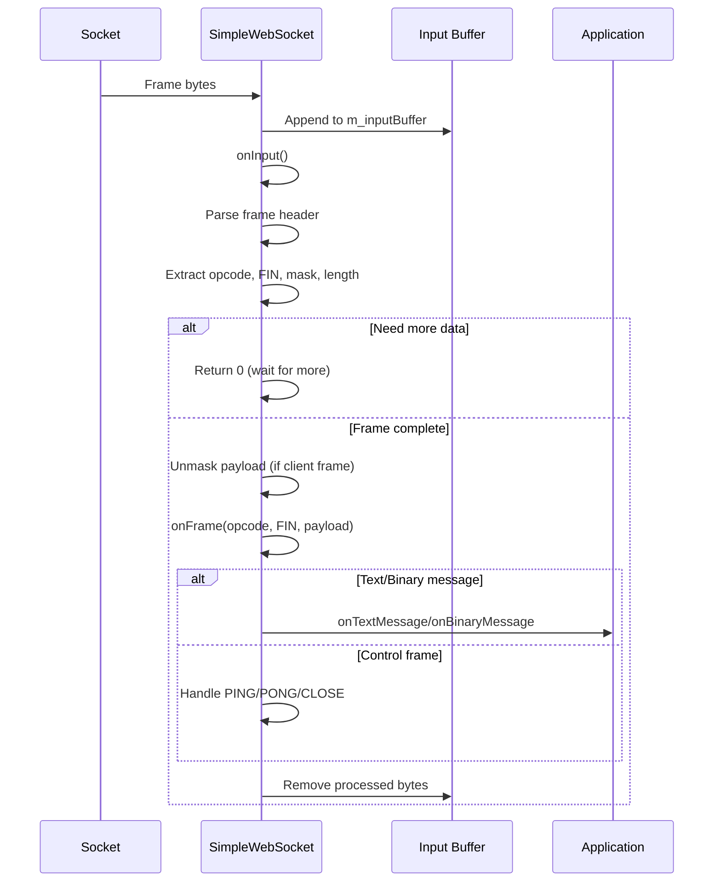

### Opcode Handling

| Opcode | Value | Behavior |
|--------|-------|----------|
| Continuation | 0x0 | Continues fragmented message |
| Text | 0x1 | Text message |
| Binary | 0x2 | Binary message |
| Close | 0x8 | Close frame |
| Ping | 0x9 | Ping frame (auto-respond with Pong) |
| Pong | 0xA | Pong frame (ignored) |

---

## Interaction Diagrams

### Complete WebSocket Server

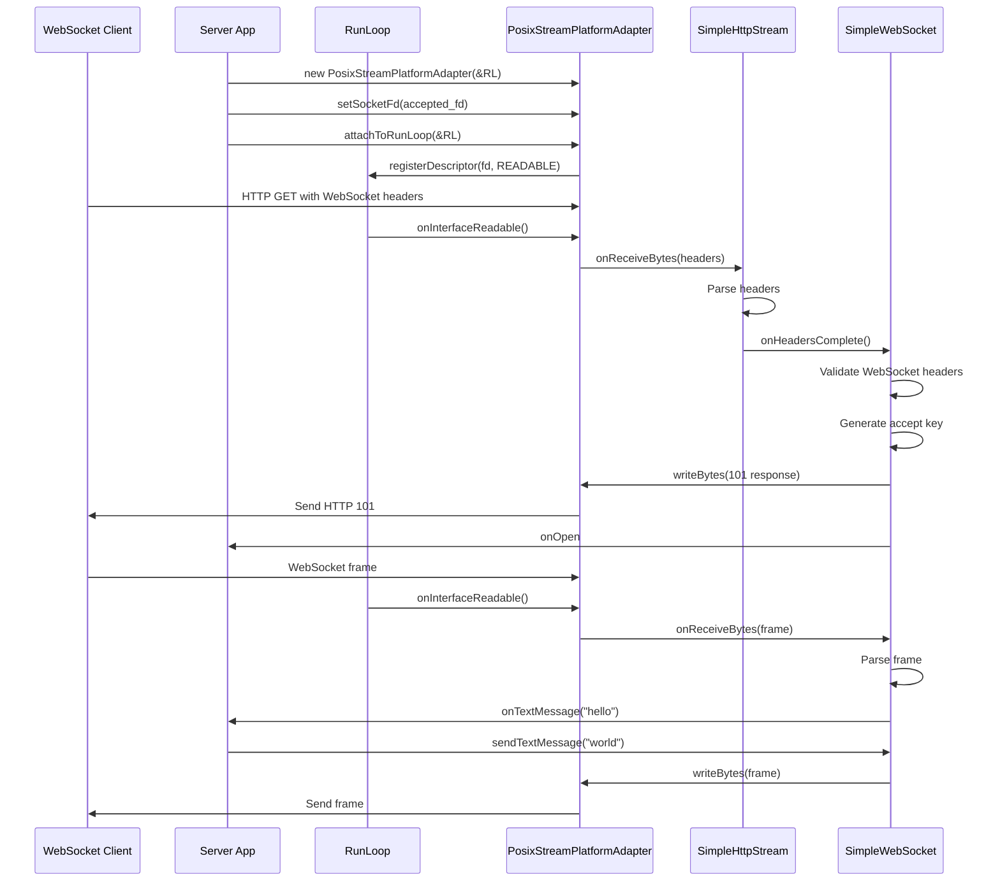

### HTTP Request Processing

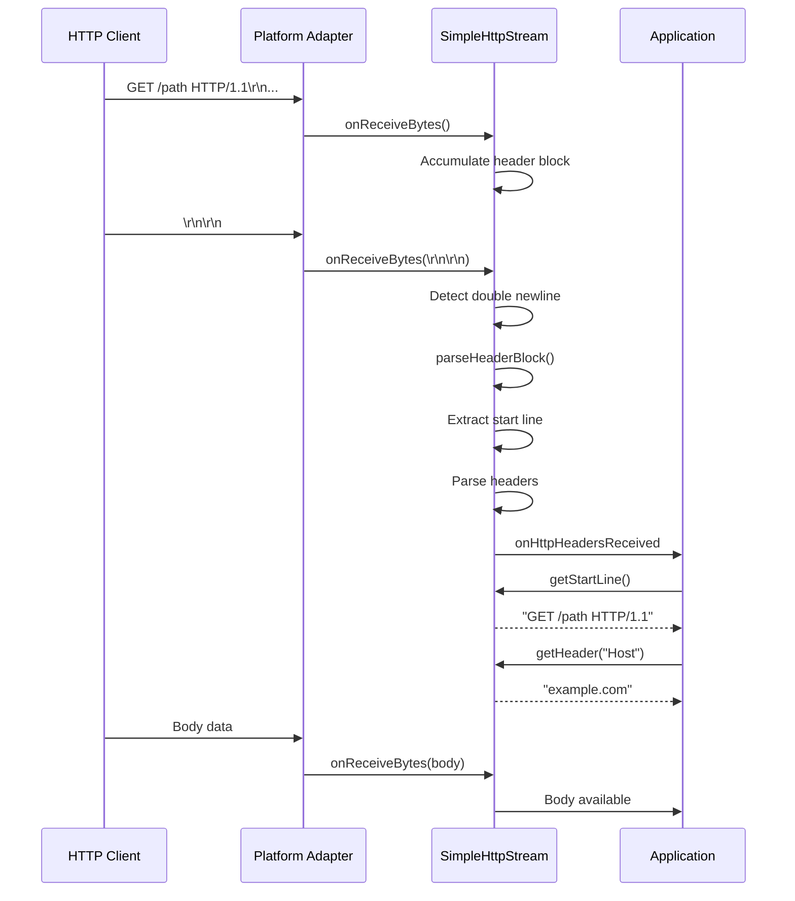

---

## API Reference

### PosixStreamPlatformAdapter

#### Full API

See [PosixStreamPlatformAdapter](#posixstreamplatformadapter) section above.

### SimpleHttpStream

#### Full API

See [SimpleHttpStream](#simplehttpstream) section above.

### SimpleWebSocket

#### Full API

See [SimpleWebSocket](#simplewebsocket) section above.

### SimpleWebSocket_OpenSSL

```cpp
class SimpleWebSocket_OpenSSL : public SimpleWebSocket {
public:
    using SimpleWebSocket::SimpleWebSocket;
    void sha1(void *dst, const void *msg, size_t len) override;
};
```

**Behavior:**
- Provides SHA-1 implementation using OpenSSL
- Required for WebSocket handshake
- Not WSS (TLS) - that's handled by platform adapter

---

## Usage Patterns

### Pattern 1: Basic HTTP Server

```cpp
PreferredRunLoop loop;
int client_fd = accept(...);

auto platform = std::make_shared<PosixStreamPlatformAdapter>(&loop);
platform->setSocketFd(client_fd);

auto http = std::make_shared<SimpleHttpStream>(platform);
http->onHttpHeadersReceived = [&]() {
    std::string method = http->getStartLine();
    std::string host = http->getHeader("Host");
    // Process request
};
http->init();
loop.run();
```

### Pattern 2: WebSocket Echo Server

```cpp
PreferredRunLoop loop;
int client_fd = accept(...);

auto platform = std::make_shared<PosixStreamPlatformAdapter>(&loop);
platform->setSocketFd(client_fd);

auto ws = std::make_shared<SimpleWebSocket_OpenSSL>(platform);
ws->onOpen = []() {
    std::cout << "WebSocket opened" << std::endl;
};
ws->onTextMessage = [&](const std::string &msg) {
    ws->sendTextMessage(msg);  // Echo
};
ws->onBinaryMessage = [&](const uint8_t *bytes, size_t len) {
    ws->sendBinaryMessage(bytes, len);  // Echo
};
ws->init();
loop.run();
```

### Pattern 3: HTTP with Body Processing

```cpp
auto http = std::make_shared<SimpleHttpStream>(platform);
http->onHttpHeadersReceived = [&]() {
    // Headers received, now process body
    // Body comes via onReceiveBytes after headers
};
// Body processing happens in platform adapter's onReceiveBytes
```

### Pattern 4: Graceful Shutdown

```cpp
auto ws = std::make_shared<SimpleWebSocket_OpenSSL>(platform);
// ... setup ...

// Later, close gracefully
ws->cleanClose();
platform->onShutdownCompleteCallback = []() {
    // Shutdown complete
};
```

---

## Best Practices

### 1. Always Call init()

```cpp
// ✅ CORRECT
auto ws = std::make_shared<SimpleWebSocket_OpenSSL>(platform);
ws->init();  // Required!

// ❌ WRONG
auto ws = std::make_shared<SimpleWebSocket_OpenSSL>(platform);
// Forgot init() - callbacks won't work
```

### 2. Handle Errors

```cpp
// ✅ CORRECT
auto http = std::make_shared<SimpleHttpStream>(platform);
http->onError = []() {
    // Handle error
};
http->init();
```

### 3. Use Clean Close

```cpp
// ✅ CORRECT
ws->cleanClose();  // Sends CLOSE frame

// ❌ WRONG
platform->close();  // Abrupt close
```

### 4. Buffer Management

```cpp
// ✅ CORRECT - Write from onwritable
platform->notifyWhenWritable([&]() {
    platform->writeBytes(data, len);
    return false;  // Stop notifications
});

// ⚠️ OK but less efficient
platform->writeBytes(data, len);  // May buffer
```

### 5. Lifetime Management

```cpp
// ✅ CORRECT
auto platform = std::make_shared<PosixStreamPlatformAdapter>(&loop);
auto ws = std::make_shared<SimpleWebSocket_OpenSSL>(platform);
// Keep both alive
```

---

## Summary

**Key Components:**

1. **IStreamPlatformAdapter**: Abstract I/O interface
2. **PosixStreamPlatformAdapter**: POSIX socket implementation
3. **SimpleHttpStream**: HTTP header parsing
4. **SimpleWebSocket**: WebSocket server implementation
5. **SimpleWebSocket_OpenSSL**: SHA-1 provider

**Key Features:**

- ✅ Platform-agnostic protocol layer
- ✅ Efficient RunLoop integration
- ✅ Automatic buffering
- ✅ HTTP/WebSocket parsing
- ✅ Graceful shutdown support

**Recommended Practices:**

- Always call `init()` after construction
- Use `cleanClose()` for WebSocket shutdown
- Handle errors via callbacks
- Keep platform and protocol objects alive
- Write from `onwritable` for best performance

