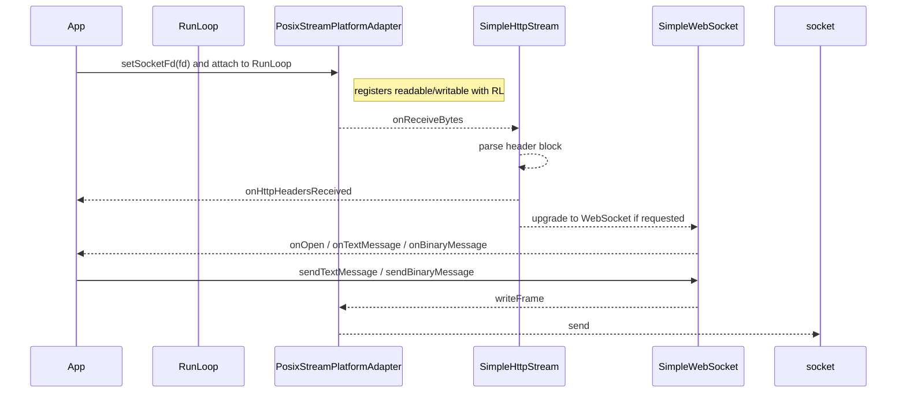

Streams: Platform Adapter, HTTP, and WebSocket
==============================================

Overview

- `IStreamPlatformAdapter`: Abstracts I/O for protocols with callbacks for writability and incoming bytes.
- `PosixStreamPlatformAdapter`: POSIX implementation integrating with a `RunLoop` and a socket fd.
- `SimpleHttpStream`: Parses HTTP request start‑line and headers (server orientation) before streaming body.
- `SimpleWebSocket`: Server‑side WebSocket on top of `SimpleHttpStream` with frame parsing and message events.
- `SimpleWebSocket_OpenSSL`: Supplies SHA‑1 using OpenSSL for the WebSocket handshake.

Data Flow



IStreamPlatformAdapter API

- Timing: `getCurrentTime()` for protocol timestamps
- Writability: `notifyWhenWritable(onwritable)`; callback returns false to stop notifications
- Receiving: `setOnReceiveBytesCallback(onreceivebytes)`; return false to stop
- Lifecycle: `setOnStreamDidCloseCallback(task)` and `onClientClosed()` when protocol is done
- Deferred: `doLater(task)` for sequencing within adapter lifecycle
- Output: `writeBytes(bytes, len)`; must accept any length (internally buffered if needed)

PosixStreamPlatformAdapter

- Construction: `PosixStreamPlatformAdapter(RunLoop *runloop=nullptr, int unsent_lowat=4096, size_t writeSizePerSelect=2048)`
- Attach/detach: `attachToRunLoop`, `detachFromRunLoop`, `close()`
- Fd management: `setSocketFd(fd)`, `getSocketFd()`
- Internals: registers read/write with the loop, batches writes up to `writeSizePerSelect`, and respects `unsent_lowat` for backpressure

SimpleHttpStream

- Events: `onHttpHeadersReceived`
- Accessors: `getStartLine()`, `hasHeader(name)`, `getHeader(name)`, `getHeaderValues(name)`
- Validation: `isToken(str)` checks RFC 9110 §5.6.2 token syntax

SimpleWebSocket

- Events: `onOpen`, `onTextMessage(std::string)`, `onBinaryMessage(const uint8_t*, size_t)`
- Send: `sendTextMessage`, `sendBinaryMessage`, `cleanClose()`
- Handshake: requires `sha1(dst, msg, len)` implementation; provided by `SimpleWebSocket_OpenSSL`

Minimal Server Example (POSIX socket assumed)

```cpp
#include <zenomt/RunLoops.hpp>
#include <zenomt/PosixStreamPlatformAdapter.hpp>
#include <zenomt/SimpleWebSocket.hpp>

using namespace com::zenomt;
using namespace com::zenomt::websock;

PreferredRunLoop loop;
int client_fd = /* accepted socket */;

auto platform = std::make_shared<PosixStreamPlatformAdapter>(&loop);
platform->setSocketFd(client_fd);

auto ws = std::make_shared<SimpleWebSocket_OpenSSL>(platform);

ws->onOpen = []{ /* ready */ };
ws->onTextMessage = [&](const std::string &msg){ ws->sendTextMessage(msg); };
ws->onBinaryMessage = [&](const uint8_t *b, size_t n){ ws->sendBinaryMessage(b, n); };

ws->init();
loop.run();
```

Notes

- TLS (WSS) is not provided here; terminate TLS before the adapter and feed the plaintext stream into the platform adapter.
- Backpressure: rely on `notifyWhenWritable` and internal buffering instead of blocking writes.
- Always call `cleanClose()` for a graceful WebSocket close when possible.


