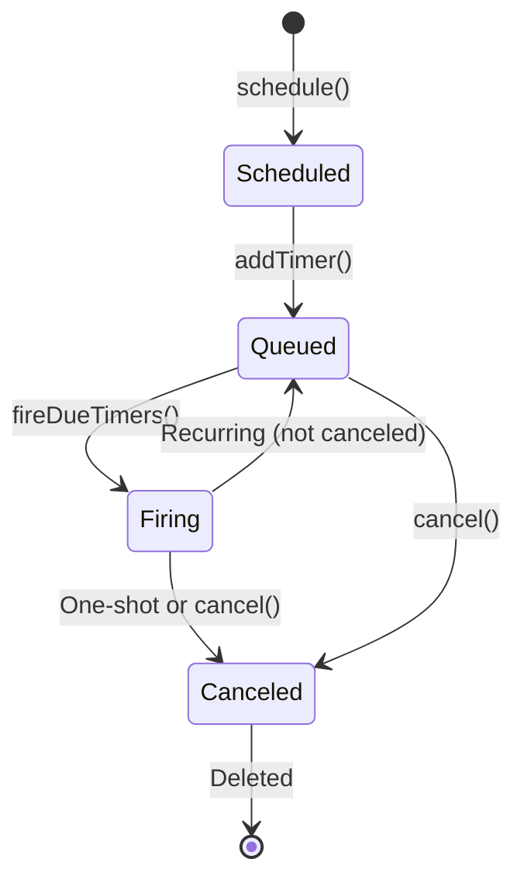
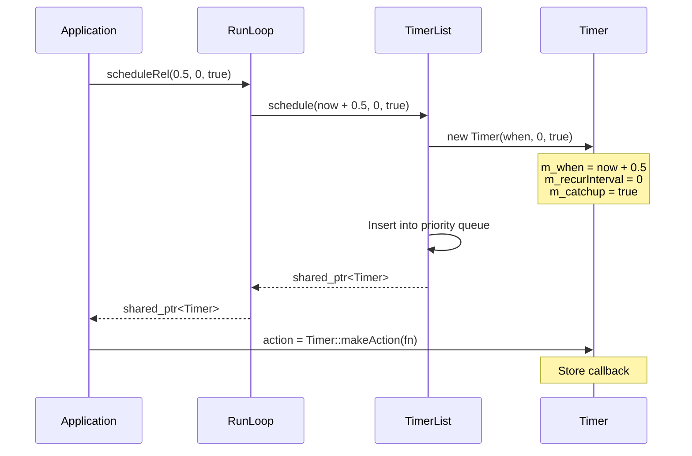
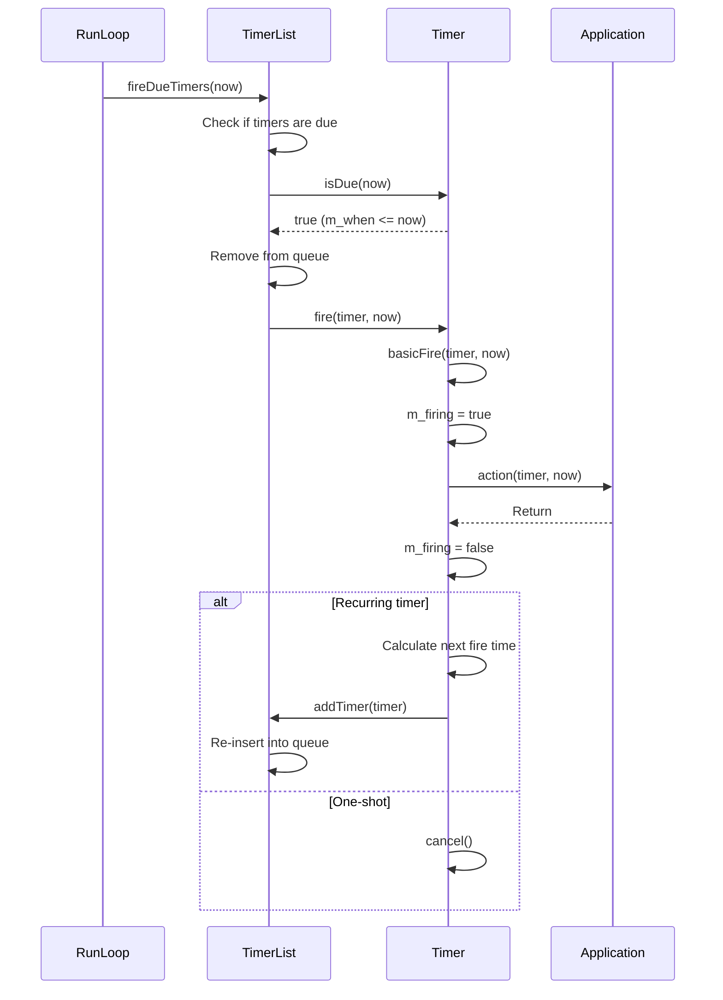
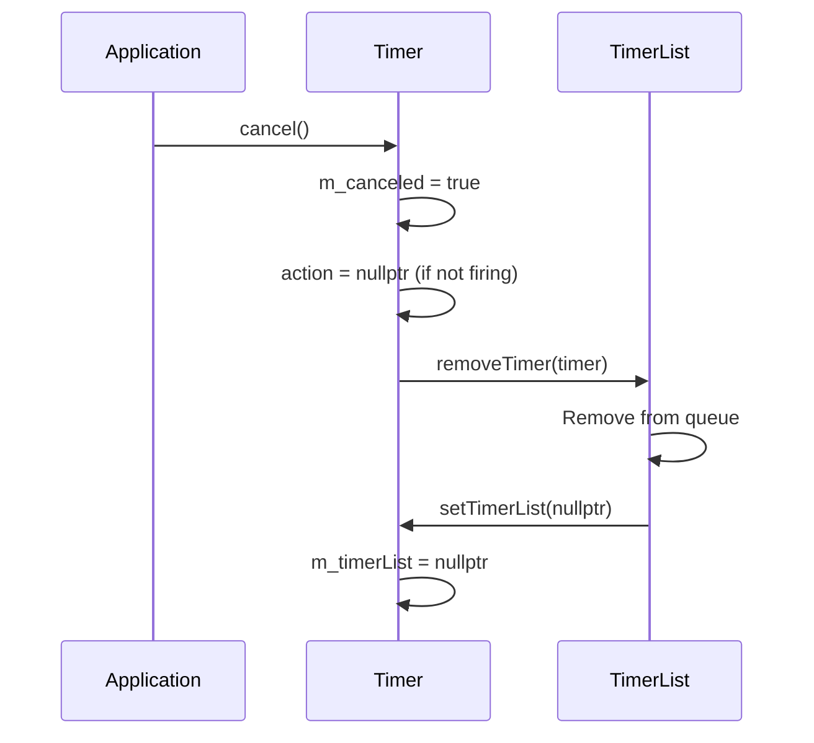
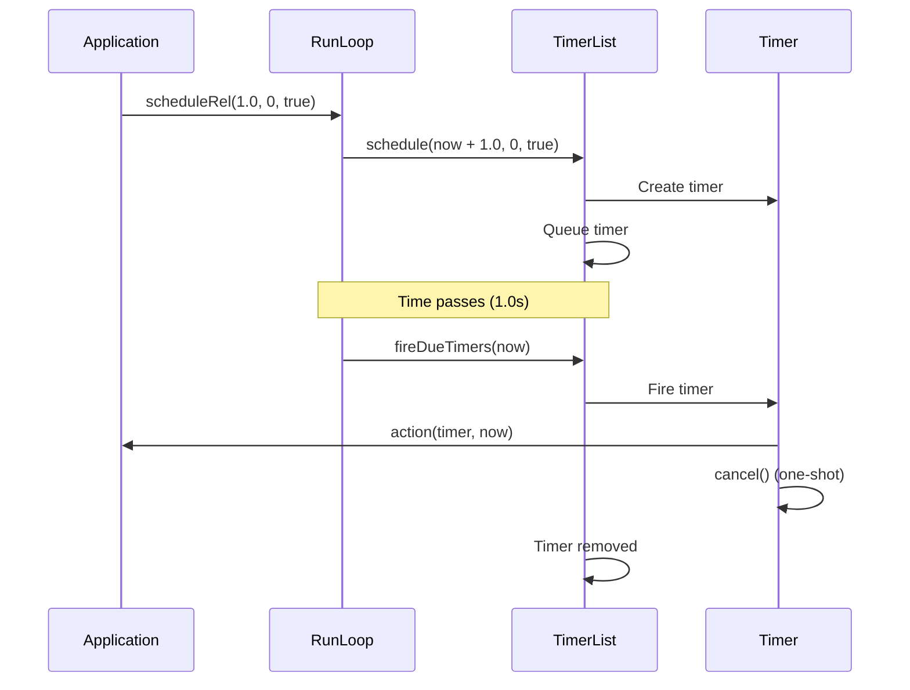
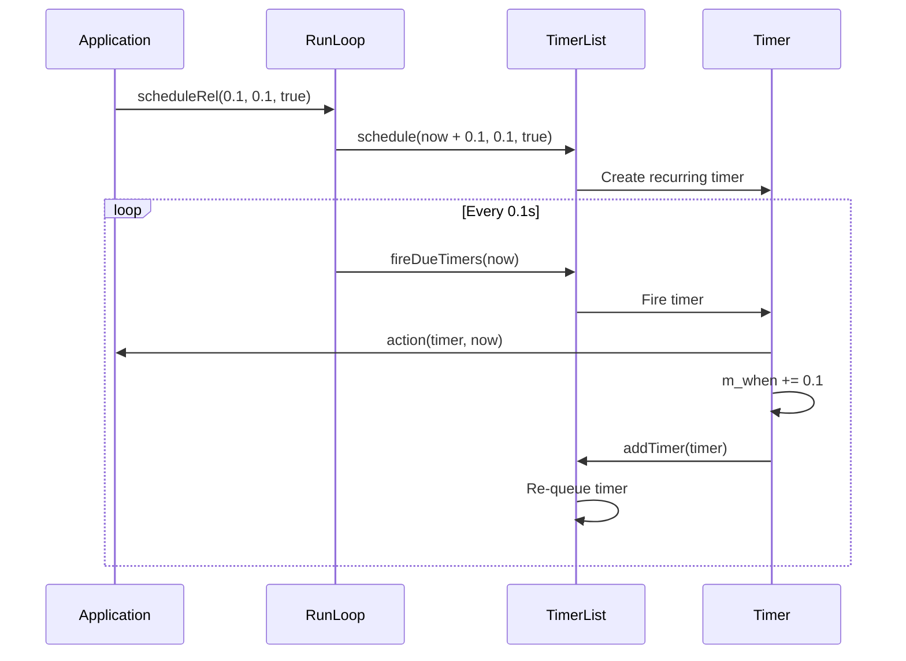
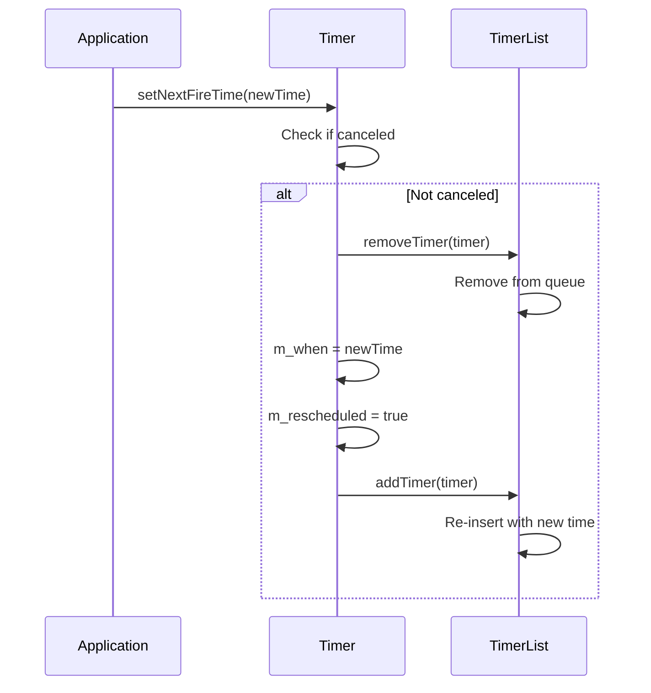
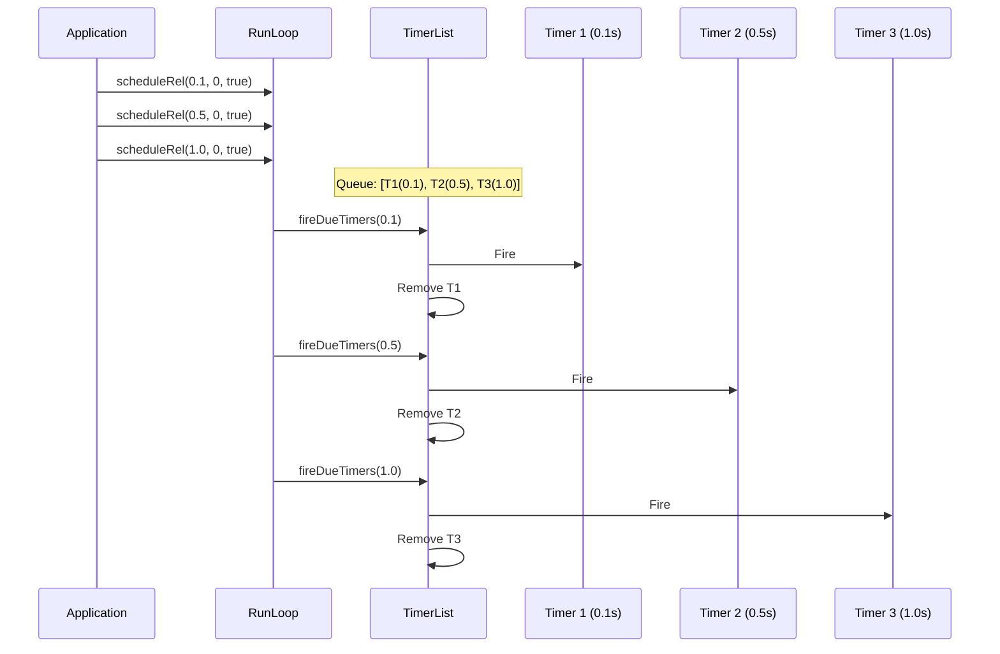
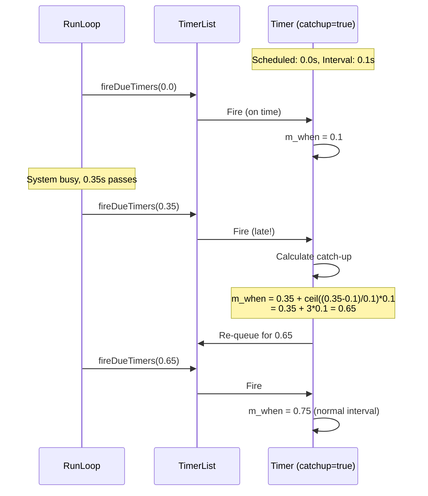
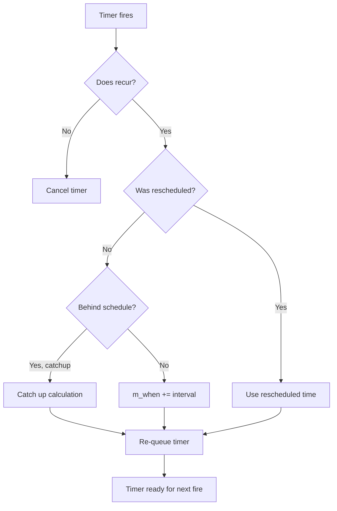

# Timer: Comprehensive Documentation

**Date:** 2024

## Overview

`Timer` provides precise scheduling with microsecond-level accuracy, supporting one-shot and recurring timers with optional catch-up behavior. Timers are managed by `TimerList` and integrated with `RunLoop`.

---

## Table of Contents

1. [Architecture](#architecture)
2. [Timer Lifecycle](#timer-lifecycle)
3. [Interaction Diagrams](#interaction-diagrams)
4. [API Reference](#api-reference)
5. [Catch-up Behavior](#catch-up-behavior)
6. [Recurrence](#recurrence)
7. [Usage Patterns](#usage-patterns)
8. [Best Practices](#best-practices)

---

## Architecture

### Timer Components

```
┌─────────────────────────────────┐
│         TimerList               │
│  ┌───────────────────────────┐ │
│  │  Priority Queue (set)      │ │
│  │  - Sorted by m_when        │ │
│  │  - O(log n) insert/remove  │ │
│  └───────────────────────────┘ │
└─────────────────────────────────┘
           │
           │ manages
           ▼
┌─────────────────────────────────┐
│           Timer                 │
│  - m_when: Next fire time       │
│  - m_recurInterval: Recurrence  │
│  - m_catchup: Catch-up flag     │
│  - action: Callback             │
│  - m_canceled: Canceled flag    │
└─────────────────────────────────┘
```

### Timer States



---

## Timer Lifecycle

### Creation and Scheduling



### Firing Process



### Cancellation



---

## Interaction Diagrams

### One-Shot Timer



### Recurring Timer



### Timer Rescheduling



### Multiple Timers



### Catch-up Behavior



---

## API Reference

### Timer

#### Construction

```cpp
Timer(Time when, Duration recurInterval, bool catchup);
```

**Parameters:**
- `when`: Absolute time to fire
- `recurInterval`: Recurrence interval (0 = one-shot)
- `catchup`: If true, catch up if behind schedule

**Note:** Timers are created via `TimerList::schedule()`, not directly.

#### Time Management

```cpp
bool isDue(Time now) const;
Time getNextFireTime() const;
void setNextFireTime(Time when);
```

**Behavior:**
- `isDue()`: Returns `true` if `m_when <= now`
- `getNextFireTime()`: Returns `m_when`
- `setNextFireTime()`: Reschedules timer (removes and re-adds to queue)

#### Recurrence

```cpp
Duration getRecurInterval() const;
void setRecurInterval(Duration interval);
bool doesRecur() const;
```

**Behavior:**
- `getRecurInterval()`: Returns recurrence interval (0 = one-shot)
- `setRecurInterval()`: Sets new interval (minimum: `MIN_RECUR_INTERVAL = 1µs`)
- `doesRecur()`: Returns `true` if recurring and not canceled

#### Control

```cpp
void cancel();
bool isCanceled() const;
```

**Behavior:**
- `cancel()`: Marks timer as canceled, removes from queue, clears action
- `isCanceled()`: Returns cancel state

#### Action

```cpp
Action action;  // Public member

static Action makeAction(const std::function<void(Time now)> &fn);
static Action makeAction(const Task &fn);
```

**Action Signature:**
```cpp
using Action = std::function<void(const std::shared_ptr<Timer> &sender, Time now)>;
```

**Helpers:**
- `makeAction(fn)`: Wraps function that takes `Time now`
- `makeAction(task)`: Wraps function that takes no arguments

### TimerList

#### Scheduling

```cpp
std::shared_ptr<Timer> schedule(Time when, Duration recurInterval = 0, bool catchup = true);
std::shared_ptr<Timer> schedule(const Timer::Action &action, Time when, Duration recurInterval = 0, bool catchup = true);
```

**Returns:** `shared_ptr<Timer>` for control

#### Querying

```cpp
Duration howLongToNextFire(Time now, Duration maxInterval = 5) const;
```

**Returns:** Time until next timer fires, or `maxInterval` if none scheduled

#### Execution

```cpp
size_t fireDueTimers(Time now);
```

**Returns:** Number of timers fired

**Behavior:**
- Fires all timers where `isDue(now)` is true
- Removes fired timers from queue
- Re-queues recurring timers

#### Management

```cpp
void addTimer(const std::shared_ptr<Timer> &timer);
void removeTimer(const std::shared_ptr<Timer> &timer);
void clear();
```

**Behavior:**
- `addTimer()`: Adds timer to priority queue
- `removeTimer()`: Removes timer from queue
- `clear()`: Removes all timers (doesn't cancel them)

---

## Catch-up Behavior

### With Catch-up (catchup=true)

**Scenario:** Timer scheduled for 0.0s, interval 0.1s, system busy until 0.35s

```cpp
// Fire times:
// 0.0s - Fire (on time)
// 0.35s - Fire (late, catch up)
// 0.4s - Fire (caught up, normal interval)
// 0.5s - Fire (normal)
```

**Calculation:**
```cpp
if((now > m_when) and m_catchup) {
    m_when += ceill((now - m_when) / m_recurInterval) * m_recurInterval;
}
// Example: 0.35 + ceil((0.35-0.1)/0.1)*0.1 = 0.35 + 3*0.1 = 0.65
// But then next fire is 0.65 + 0.1 = 0.75 (normal interval)
```

**Use cases:**
- Periodic updates that must catch up
- Animation frames
- Status reports

### Without Catch-up (catchup=false)

**Scenario:** Timer scheduled for 0.0s, interval 0.1s, system busy until 0.35s

```cpp
// Fire times:
// 0.0s - Fire (on time)
// 0.35s - Fire (late, no catch up)
// 0.45s - Fire (0.35 + 0.1)
// 0.55s - Fire (0.45 + 0.1)
```

**Calculation:**
```cpp
m_when += m_recurInterval;  // Always add interval
```

**Use cases:**
- Rate limiting
- Heartbeats
- Sampling (don't want to catch up)

---

## Recurrence

### Minimum Interval

```cpp
const Duration MIN_RECUR_INTERVAL = 0.000001;  // 1 microsecond
```

**Enforcement:**
- `setRecurInterval()` clamps values below minimum
- Prevents excessive timer churn

### Recurrence Logic



### Rescheduling During Fire

```cpp
timer->action = Timer::makeAction([&](Time now) {
    // Fire at 0.1s
    timer->setNextFireTime(now + 0.5);  // Reschedule to 0.6s
    // m_rescheduled = true, so recurrence interval is ignored
});
```

---

## Usage Patterns

### Pattern 1: One-Shot Timer

```cpp
PreferredRunLoop loop;

auto timer = loop.scheduleRel(1.0, 0, true);
timer->action = Timer::makeAction([&](Time now) {
    // Do something once after 1 second
    loop.stop();
});

loop.run();
```

### Pattern 2: Periodic Timer

```cpp
PreferredRunLoop loop;

// Every 100ms
auto timer = loop.scheduleRel(0.1, 0.1, true);
timer->action = Timer::makeAction([&](Time now) {
    // Periodic work
});
```

### Pattern 3: Timer with Catch-up

```cpp
PreferredRunLoop loop;

// Animation frame timer (catch up if behind)
auto timer = loop.scheduleRel(0.016, 0.016, true);  // ~60 FPS
timer->action = Timer::makeAction([&](Time now) {
    updateAnimation(now);
});
```

### Pattern 4: Timer without Catch-up

```cpp
PreferredRunLoop loop;

// Rate limiter (don't catch up)
auto timer = loop.scheduleRel(1.0, 1.0, false);
timer->action = Timer::makeAction([&](Time now) {
    sendHeartbeat();  // Exactly every 1 second, no catch-up
});
```

### Pattern 5: Rescheduling Timer

```cpp
PreferredRunLoop loop;

auto timer = loop.scheduleRel(1.0, 0, true);
timer->action = Timer::makeAction([&](const std::shared_ptr<Timer> &t, Time now) {
    // Do work
    if(shouldContinue()) {
        t->setNextFireTime(now + calculateDelay());
    } else {
        t->cancel();
    }
});
```

### Pattern 6: Multiple Timers

```cpp
PreferredRunLoop loop;

// Fast timer
auto fast = loop.scheduleRel(0.01, 0.01, true);
fast->action = Timer::makeAction([&](Time now) {
    // Frequent updates
});

// Slow timer
auto slow = loop.scheduleRel(1.0, 1.0, true);
slow->action = Timer::makeAction([&](Time now) {
    // Periodic reports
});
```

### Pattern 7: Timer Cancellation

```cpp
PreferredRunLoop loop;

auto timer = loop.scheduleRel(5.0, 0, true);
timer->action = Timer::makeAction([&](Time now) {
    // Timeout handler
});

// Later...
if(condition) {
    timer->cancel();  // Prevent timeout
}
```

---

## Best Practices

### 1. Always Set Action

```cpp
// ✅ CORRECT
auto timer = loop.scheduleRel(1.0, 0, true);
timer->action = Timer::makeAction([&](Time now) {
    // Work
});

// ❌ WRONG
auto timer = loop.scheduleRel(1.0, 0, true);
// Forgot to set action - fires with null action
```

### 2. Use Appropriate Catch-up

```cpp
// ✅ CORRECT - Animation (catch up)
auto anim = loop.scheduleRel(0.016, 0.016, true);

// ✅ CORRECT - Rate limit (no catch up)
auto limit = loop.scheduleRel(1.0, 1.0, false);
```

### 3. Cancel When Done

```cpp
// ✅ CORRECT
auto timer = loop.scheduleRel(1.0, 0.1, true);
timer->action = Timer::makeAction([&](const std::shared_ptr<Timer> &t, Time now) {
    if(done) {
        t->cancel();
    }
});
```

### 4. Handle Timer Lifetime

```cpp
// ✅ CORRECT
auto timer = loop.scheduleRel(1.0, 0, true);
// Timer auto-cancels when done (one-shot)

// ✅ CORRECT - Manual cleanup
timer->cancel();
timer.reset();
```

### 5. Avoid Long Operations

```cpp
// ❌ WRONG
timer->action = Timer::makeAction([&](Time now) {
    processHugeFile();  // Blocks RunLoop!
});

// ✅ CORRECT
timer->action = Timer::makeAction([&](Time now) {
    loop.doLater([]() {
        processHugeFile();  // In next cycle
    });
});
```

### 6. Use Relative Scheduling

```cpp
// ✅ CORRECT - Relative (recommended)
auto timer = loop.scheduleRel(1.0, 0, true);

// ⚠️ OK - Absolute (requires time calculation)
Time now = loop.getCurrentTime();
auto timer = loop.schedule(now + 1.0, 0, true);
```

---

## Performance Considerations

### Timer Queue Operations

- **Insertion**: O(log n) where n = number of timers
- **Removal**: O(log n)
- **Query next fire**: O(1) (first element)
- **Fire due timers**: O(k log n) where k = number of due timers

### Typical Performance

- **100 timers**: < 1 µs per operation
- **1000 timers**: < 10 µs per operation
- **10000 timers**: < 100 µs per operation

### Optimization Tips

1. **Cancel unused timers**: Reduces queue size
2. **Use appropriate intervals**: Don't schedule too frequently
3. **Batch operations**: Combine multiple timers if possible

---

## Thread Safety

| Operation | Thread-Safe | Notes |
|-----------|-------------|-------|
| `schedule()` | ⚠️ Partial | Safe if RunLoop not running |
| `cancel()` | ✅ Yes | Can be called from any thread |
| `setNextFireTime()` | ⚠️ Partial | Safe if RunLoop not running |
| `action` assignment | ⚠️ Partial | Safe if timer not firing |
| `fireDueTimers()` | ❌ No | Must be called from RunLoop thread |

---

## Common Pitfalls

### Pitfall 1: Forgetting to Set Action

```cpp
// ❌ WRONG
auto timer = loop.scheduleRel(1.0, 0, true);
// Action is null - timer fires but does nothing

// ✅ CORRECT
auto timer = loop.scheduleRel(1.0, 0, true);
timer->action = Timer::makeAction([&](Time now) {
    // Work
});
```

### Pitfall 2: Blocking in Action

```cpp
// ❌ WRONG
timer->action = Timer::makeAction([&](Time now) {
    sleep(1);  // Blocks RunLoop!
});

// ✅ CORRECT
timer->action = Timer::makeAction([&](Time now) {
    loop.doLater([]() {
        // Long operation
    });
});
```

### Pitfall 3: Modifying Timer During Fire

```cpp
// ⚠️ CAUTION
timer->action = Timer::makeAction([&](const std::shared_ptr<Timer> &t, Time now) {
    t->setRecurInterval(0.2);  // OK - reschedules
    t->cancel();  // OK - cancels
    // But don't access t after cancel
});
```

### Pitfall 4: Circular References

```cpp
// ❌ WRONG - Circular reference
std::shared_ptr<Timer> timer;
timer = loop.scheduleRel(1.0, 0, true);
timer->action = Timer::makeAction([timer](Time now) {
    // Captures timer, creates cycle
});

// ✅ CORRECT
auto timer = loop.scheduleRel(1.0, 0, true);
timer->action = Timer::makeAction([&](const std::shared_ptr<Timer> &t, Time now) {
    // Use parameter, not capture
});
```

---

## Summary

**Key Takeaways:**

1. ✅ Timers are managed by `TimerList` in priority queue
2. ✅ Support one-shot and recurring timers
3. ✅ Catch-up behavior controls late timer handling
4. ✅ Minimum interval: 1 microsecond
5. ✅ Can reschedule during fire
6. ⚠️ Always set action after scheduling
7. ⚠️ Don't block in timer actions

**Recommended Practices:**

- Use `scheduleRel()` for relative timing
- Set action immediately after scheduling
- Use catch-up for animations, no catch-up for rate limiting
- Cancel timers when done
- Keep actions short and non-blocking
- Use `doLater()` for longer operations

